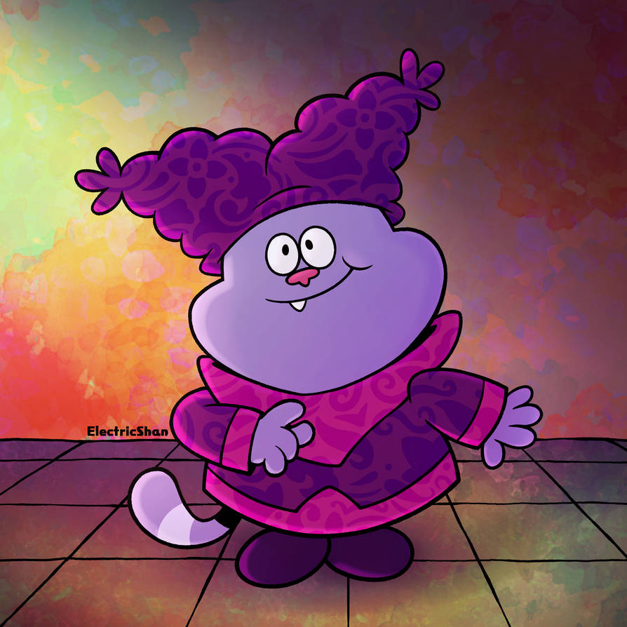
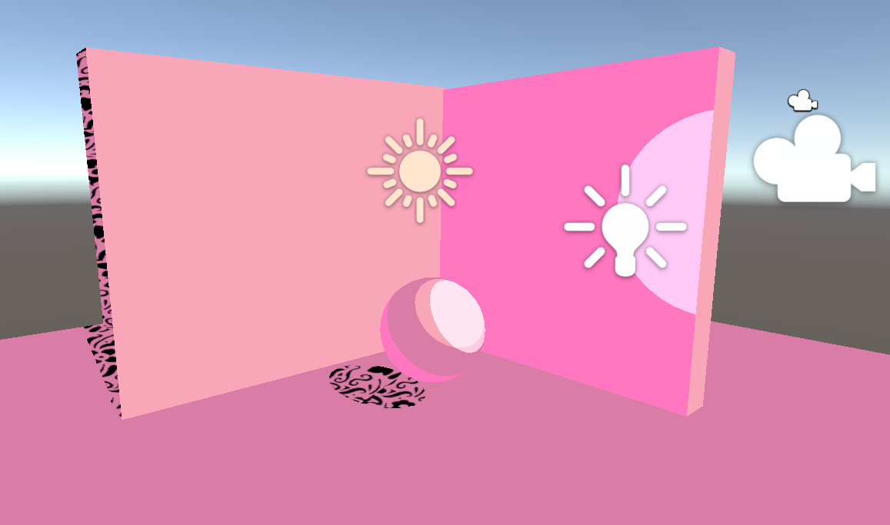
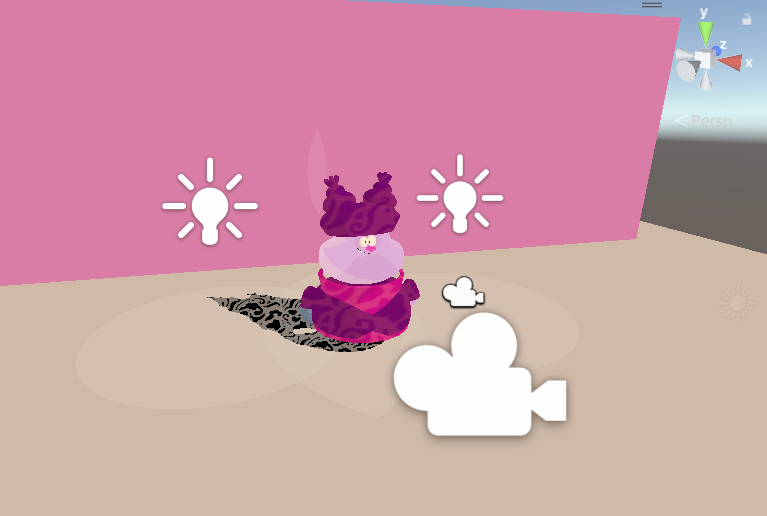
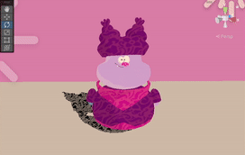
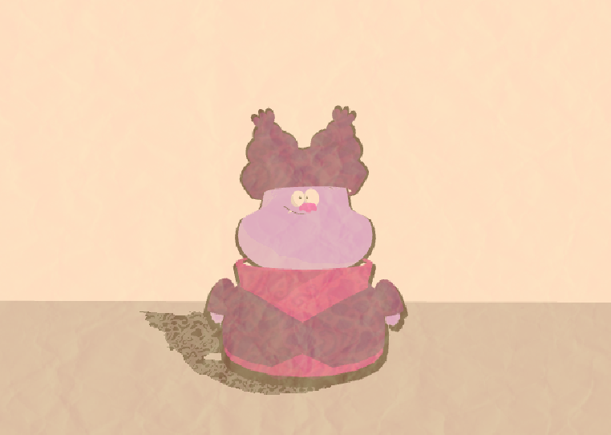

# HW 4: *3D Stylization*
## Aboudi Rai

## 1. Reference
Here is my reference image of Chowder from my favorite Cartoon Network series of all time,
*Chowder*:

Credit: ElectricShan on DeviantArt

## 2. Adding some interesting shaders

### 1. Improved Surface Shader

I followed the provided tutorial in order to have objects shaded by multiple light sources, while
also adding a textured shadow based on the texture of Chowder's clothing and hat.

Here are the same materials using this improved shader, now applied on my Chowder character model.

### 2. Special Surface Shader

For this special surface shader, I was added animation to some of the textures used on the character
and the shadows. I had the different colors translate in different directions to create some
tasteful contrast.

## 3. Outlines

My character outline can be seen in the demo scene.

## 4. Full Screen Post Process Effect

For the full screen post process effect, I applied a paper texture to simulate an animation that
was drawn on crinkled paper. Here is an early iteration of the effect:

[Paper Texture Source](https://forum.unity.com/threads/setting-a-paper-texture-effect-to-2d-sprites.458874/)

## 5. Final Scene

I conveniently chose Chowder for this assignment so I could use my model from the character modeling project from
DSGN 5005:

Using this character, I built a simple scene of Chowder in a room, which can be observed in the
scene demo. I added a grid texture to the floor, and Chowder's signature clothing texture to the walls.

## 6. Realtime Interactivity

For a realtime interactivity feature, I modified the Turntable script so that the 'Up' and 'Down'
arrow keys change the color of the wall situated behind Chowder in the scene. This feature is
displayed in the final scene demo.

## Scene Demo

<video src="img/readme-vid-ppt.mp4" controls></video>