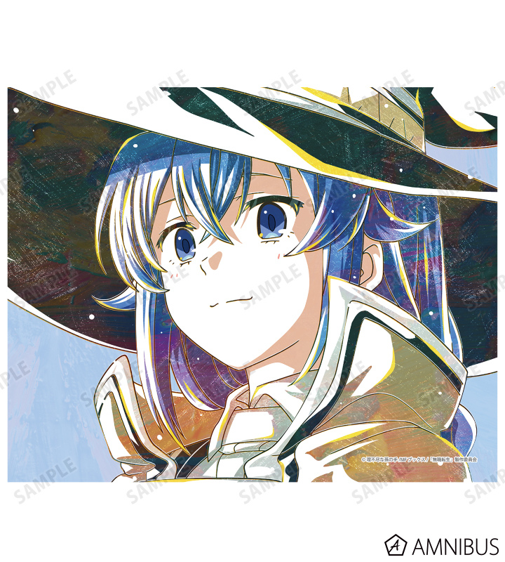
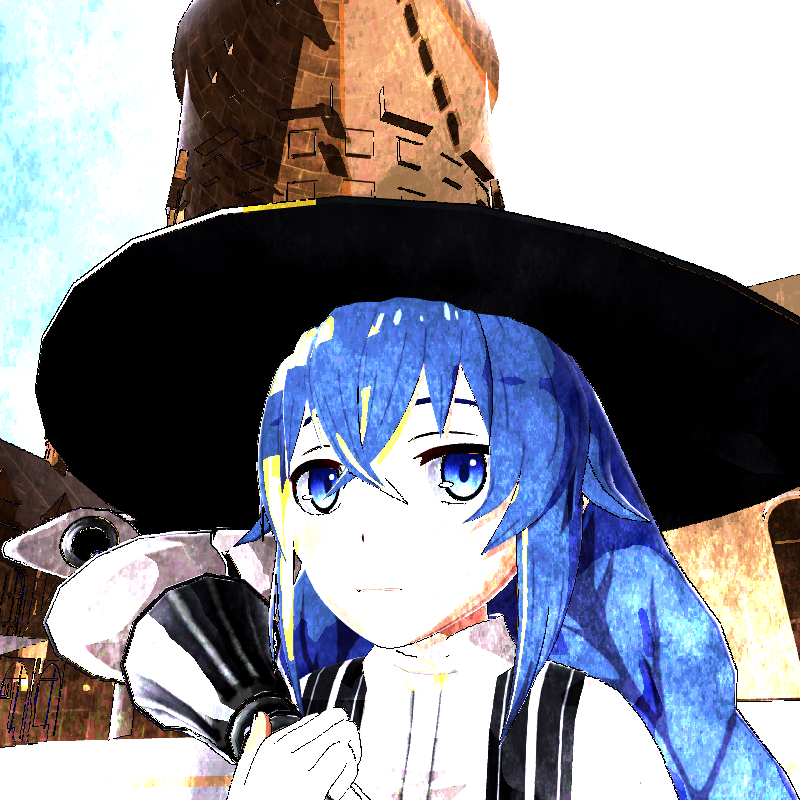
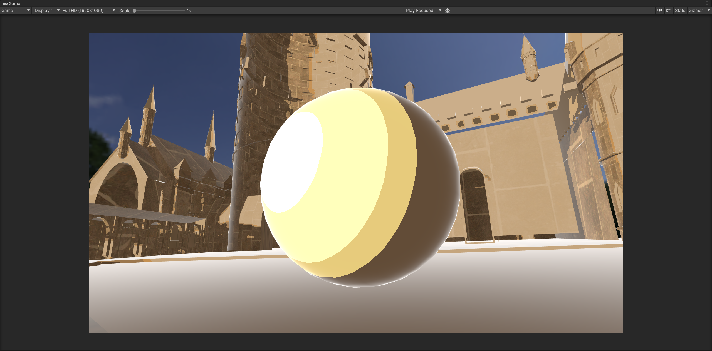
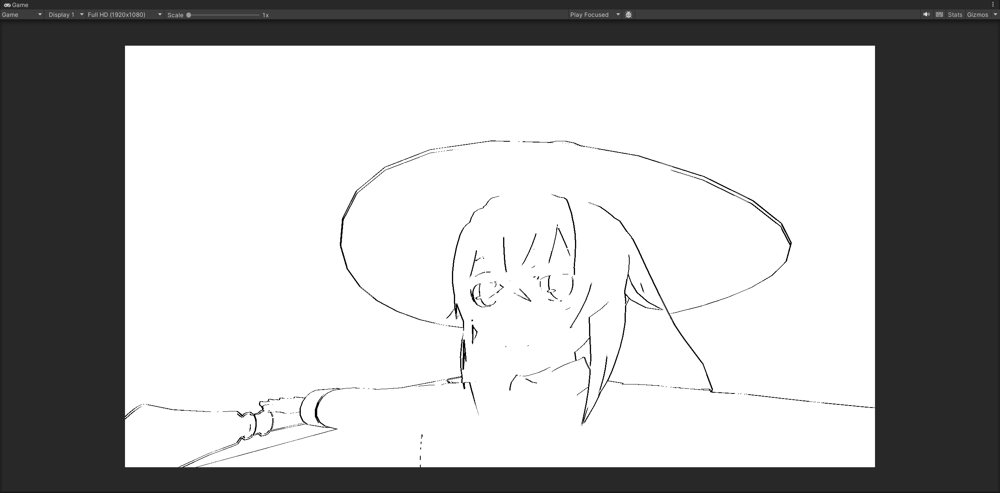
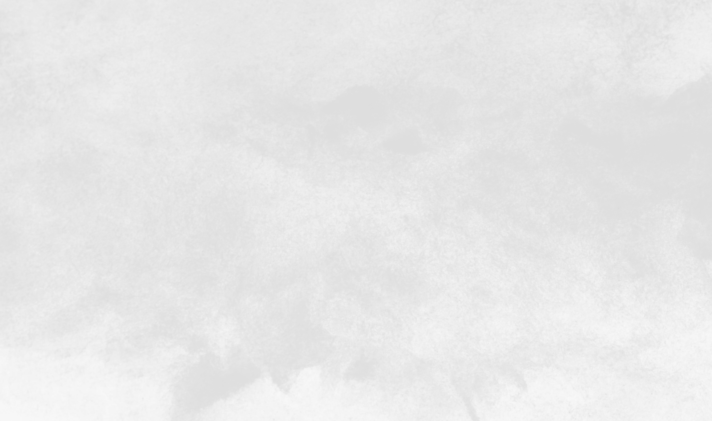
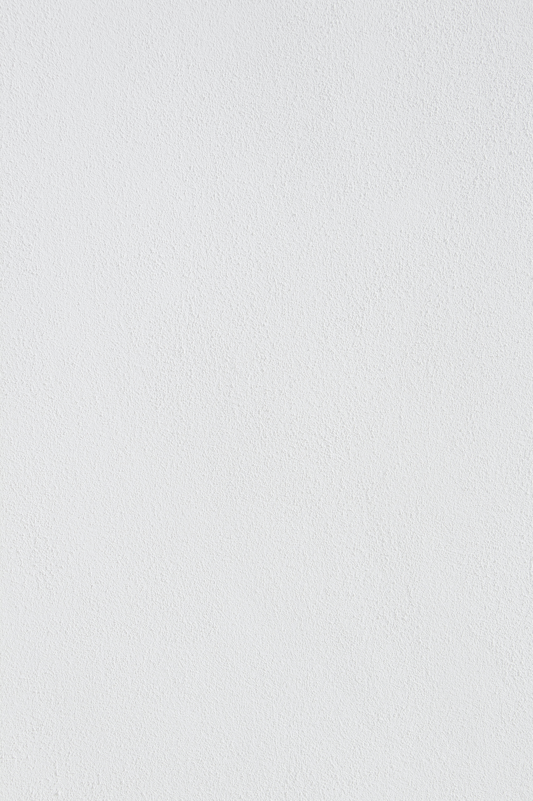
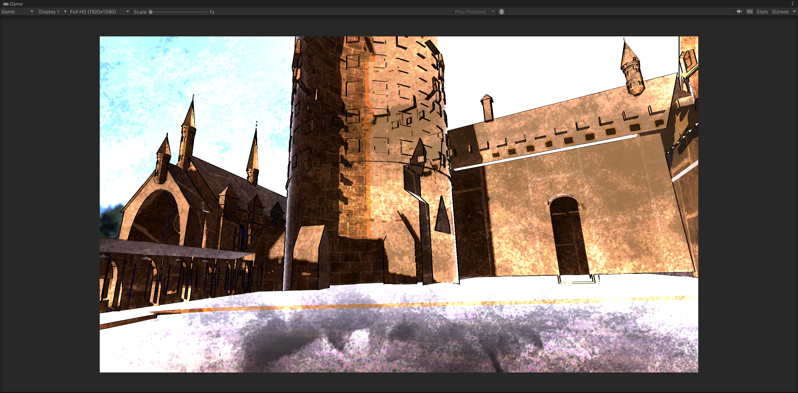
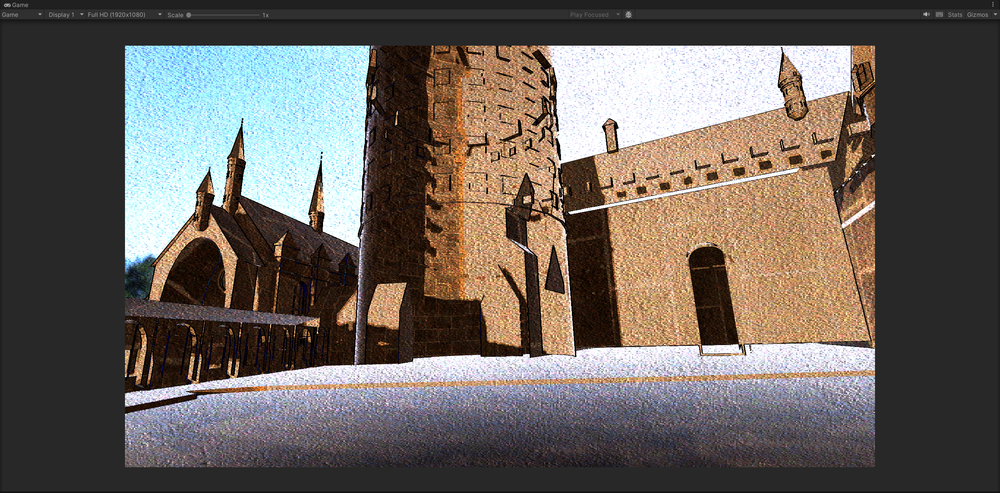

# HW 4: *3D Stylization*

## Overview

In this assignment, I created a 3D stylized scene based on a 2D illustration, and explored many stylized graphics techniques alongside non-physically-based real-time rendering workflows in Unity. The illustration I chose is a 2D concept illustration of Roxy Migurdia from the anime *Mushoku Tensei: Jobless Reincarnation*. 


## Demo

| ||
|:--:|:--:|
| *2D Concept Illustration* | *3D Stylized Scene in Unity* |

Image source: [Roxy Migurdia Ani-Art Canvas Board](https://amnibus.com/products/detail/26574)


## Implementation

### Lighting

From the illustration, it's evident that the character's colors include two types of highlights, yellow and white, but these highlights do not appear on the skin, so it's necessary to use a mask for processing. For the rest of the parts, the number of thresholds in the toon shader should be increased to three to handle the extra highlight. Additionally, I implemented Rim Highlight as an Additional Lighting Feature.

```hlsl
void RimHighlight_float(float3 WorldPosition, float3 Normal, float RimPower, out float3 OUT)
{
    float3 viewDir = normalize(_WorldSpaceCameraPos - WorldPosition);
    float rim = 1.0 - saturate(dot(Normal, viewDir));
    rim = pow(rim, RimPower);
    OUT = float3(rim, rim, rim);
}
```



### Shadows

As can be seen in the illustration, particularly in areas like the hat, the shadows have a certain style. To get as close as possible to this, I used Photoshop to crop out the most distinct shadow areas from the image, and I adjusted the curves to preserve the characteristics of the shadows, resulting in a shadow texture. I implemented a Tint function, which converts the bright parts to the original color and the dark parts to the shadow color, making it compatible with the original colors. Based on this, by shifting the UV over time, the effect of the moving shadow can be observed.

### Special Surface Shader

I have implemented Animated colors. To ensure a smooth transition of colors, I used HSV to convert the time input. When specifying hue, I used two toolbox functions, CubicPulse and Sawtooth_wave, to vary the rate of color change at times and to make the color change periodically. For saturation, I used a sine function to transform over time. The value is fixed at 1. The following is the code for the function.

```hlsl
float3 RandomColor(float3 Color, float Seed)
{
    float hue = CubicPulse(0, 1, Sawtooth_wave(Seed, 0.2, 1.0));
    float maxSaturation = 1;
    float minSaturation = 0.97;
    float saturation = (sin(Seed * 2) + 1.0) * 0.5 * (maxSaturation - minSaturation) + minSaturation;
    float value = 1.0;
    float3 randomColor = HSVtoRGB(hue, saturation, value);
    return pow(randomColor, 1/2.2);
}
```

For all of the above features, I implemented HLSL functions, which are then processed together in BlendLight_float. In the shadergraph, I used a custom function node BlendLight to connect corresponding inputs and outputs.

### Outlines

The outlines in the illustration I chose are quite plain, so I tried to use a toolbox function to get closer to the effect of pencil sketching. I referenced a video at [Blender Pencil Style Outline Tutorial!
](https://www.youtube.com/watch?v=a4mV7sCewM0) and overlaid outlines with different offsets. Each outline is a triangle_wave with a relatively small amplitude, with time as its input. This way, you can see an effect close to that of a pencil.




### Full Screen Post Process Effect

Since the illustration itself is drawn on paper, I chose to use a paper texture to post-process the image to make it look like it's drawn on paper. 

| Watercolor Texture                                          | Paper Texture                                               |
| ----------------------------------------------------------- | ------------------------------------------------------------ |
|  |  |
|  |  |

The content of the function is as follows: 

```hlsl
float3 PaperEffect(float3 Color, float3 PaperColor)
{
    float3 dodgedCol = Color / (1 - PaperColor);
    float3 combinedCol = lerp(Color, dodgedCol, (PaperColor.r + PaperColor.g + PaperColor.b) * 0.3333);
    combinedCol *= PaperColor;
    return combinedCol;
}
```

Again, I integrated all the features of the post-processing part into one function for processing, using a custom function node named Postprocess in the shadergraph to connect the corresponding inputs and outputs.

### Scene

In the illustration I chose, there's only Roxy's upper body, and there isn't much background, so I didn't place too many objects in the scene. I found a high-quality 3D model of Roxy, as well as a model of Hogwarts. I also used an animation clip to drive Roxy's movements. Although the scene is relatively simple, one can still discern a unique rendering style. 

### Interactive Features

Previously, I used a paper texture for post-processing, but it's hard to say it achieved the effect of this illustration, so I found an alternative paper texture with a completely uniform pattern, which can be switched in Game mode. In addition, I implemented some key functions:

* `A` and `D` keys: Rotate the directional light around the y-axis and modify the state of the skybox texture (rotation, exposure)
* `R` key: Reset the directional light
* `Q` key: Toggle the use of animated hair

## Extra Credit

I added a skybox and aligned the bright part of the skybox with the direction of the light source. Then, after pressing the key, I adjusted the skybox's exposure to match the intensity of the light received by the character, which can roughly achieve the effect of day and night transition. Additionally, the strength of outlines will change with the intensity of the light source.

## Credits:

* Character model: [Roxy Migurdia - Mushoku Tensei
](https://sketchfab.com/3d-models/roxy-migurdia-mushoku-tensei-ad91a07cfd88478fa8022398d1206eac)
* Background model: [Hogwarts 3D](https://sketchfab.com/3d-models/hogwarts-3d-70dcec840f8444dda2974aa6a9b049e2)
* Animation clip for character: [Anime Girl Idle Animations Free](https://assetstore.unity.com/packages/3d/animations/anime-girl-idle-animations-free-150406)
* Paper texture 1: [Painted surface with abstract watercolor
](https://www.freepik.com/free-photo/painted-surface-with-abstract-watercolor_10854122.htm#query=watercolor%20texture&position=11&from_view=keyword&track=ais)
* Paper texture 2: [White wall paint with black line
](https://unsplash.com/photos/white-wall-paint-with-black-line-3Om4DHcaAc0)

* [Blender Pencil Style Outline Tutorial!
](https://www.youtube.com/watch?v=a4mV7sCewM0)