# Stylized Worlds

## [Live Interactive Demo](https://utkarshdwivedi3997.github.io/cis566-hw04-stylization/)

# Project Overview

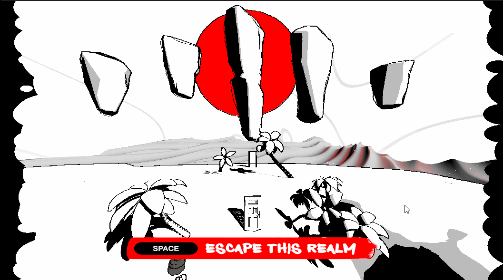

This project is a small stylization experiment I did for a homework in my Procedural Graphics course at the University of Pennsylvania. It was completed in roughly 5 days.

The original goal was to take a piece of concept art and make a stylized scene in the Unity Engine inspired by that concept art. I took a slightly modified approach and made a very simple playable loop where the player travels between two very different worlds through a door that acts like a portal.

# Table of Contents

- [Breakdown](#breakdown)
  - [Inspirations](#inspirations)
  - [Toon Shading](#toon-shading)
  - [Outlines](#outlines)
  - [Dithered Fading](#dithered-fading)
  - [Gerstner Waves](#gerstner-waves)
  - [Portal Distortion](#portal-distortion)
  - [Curtains (Vignette?) Post Process Effect](#curtains-vignette-post-process-effect)
  - [The Second Scene](#the-second-scene)
  - [Animation Curves!](#animation-curves)
  - [Skybox](#skybox)
  - [UI and Fonts](#ui-and-fonts)
- [Future](#future)
- [Credits](#credits)
    - [Style Inspirations](#style-inspirations)
    - [3D Models](#3d-models)
    - [Fonts](#fonts)
    - [Outlines](#outlines-1)
    - [Gerstner Waves](#gerstner-waves-1)

# Breakdown

## Inspirations

1. [This trailer](https://www.youtube.com/watch?v=IfKNOUUtyCA) for the movie Suzume has been something I keep going back to every once in a while. I haven't even seen the movie yet, but the trailer itself is just so aesthetically pleasing! The very first shot of a door is something that I wanted to recreate in some way, and that's where the mysterious door theme came from in this project.

|Suzume Movie Poster|
|:-:|
|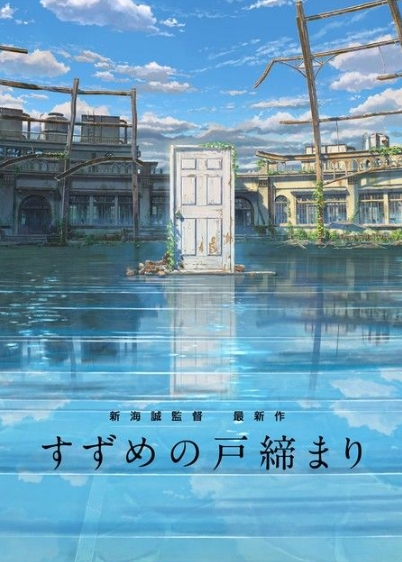|

2. [Gris](https://www.youtube.com/watch?v=BRiKQIVo7ao) by Nomada Studio uses a very minimalistic, water-coloured, aesthetic with simple outlines, and the analogous colour scheme is very pleasing. This is what I decided to try and replicate.

|Gris Trailer Screenshot|
|:-:|
|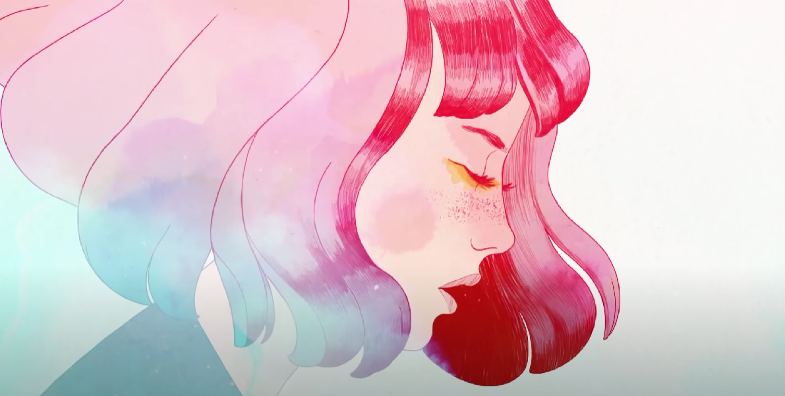|

3. At some point while working on this project, I got inspired to do something with the mysterious doors that was a little more interesting than just scattering a bunch of doors over the scene. I decided to find another art style that would be relatively easy to create with the shaders I had already created, but would still be a stark contrast to the main style. The door would act as a portal from one realm to the other. I found [this artwork by "rudut2015"](https://stock.adobe.com/images/japan-traditional-japanese-painting-sumi-e-art-sun-mountain-sakura-lake/156204903) for this purpose.

|Artwork|
|:-:|
|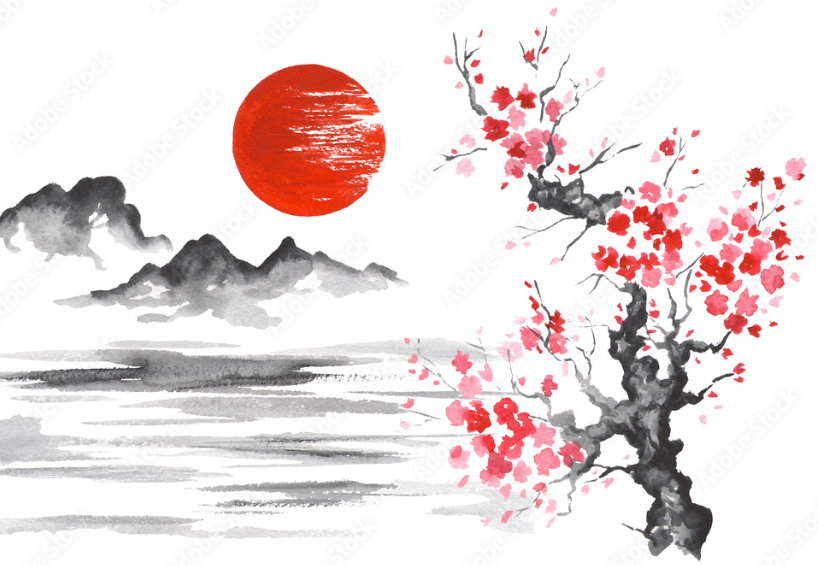|

## Toon Shading

Suzume, like most anime, uses a toon shaded art style. Toon shading is a great basis look to start off of.

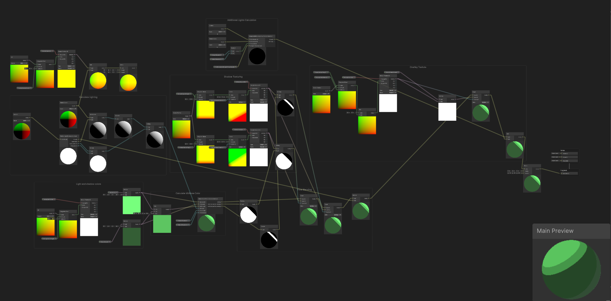

The shader graph for this toon shader looks very complex, but it is rather simple in concept. It first performs Lambertian shading on a model, then `step`s anything above a certain threshold to the lit area of the surface, and everything else into the unlit (in shadow) area of the surface. There is an additional `step` that finds a "midtone" between the lit and shadow colours (the midtone colour is a halfway lerp between the lit and shadow colours), and this colour is put in between the lit and shadow areas.

I added support for **textures** on the shadow and midtone sections. This can be used to add something like a hatched shadow effect, though that is not something that is used in the demo scene. Additional lights are also supported, but similarly not used.

|Simple Toon Shading|
|:-:|
|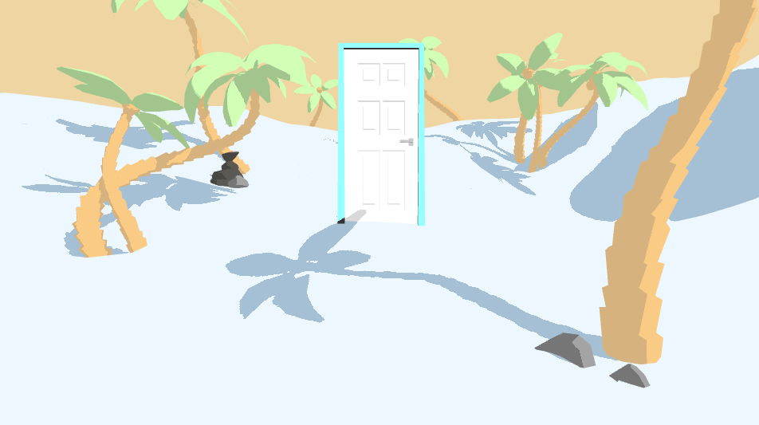|

One of the things that Gris does is affect surfaces based on a *static* watercolour like texture sampled in screen-space. I first tried to do this by sampling a texture only in the lit areas, but that didn't look good, so I changed this texture to be an *overlay* on top of the whole surface. This looked a lot closer to the Gris art style.

I created a few "watercolour" textures in Photoshop to overlay on to the scene, and allowed manually changing the colour for this overlay.

<table>
    <tr>
        <td colSpan=3 align="center">Watercolour textures</td>
    </tr>
    <tr>
        <td>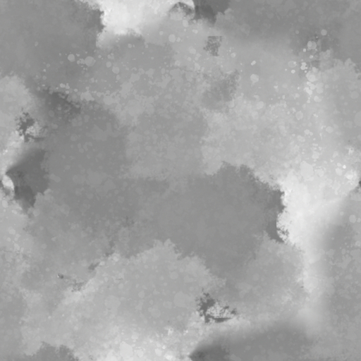</td>
        <td>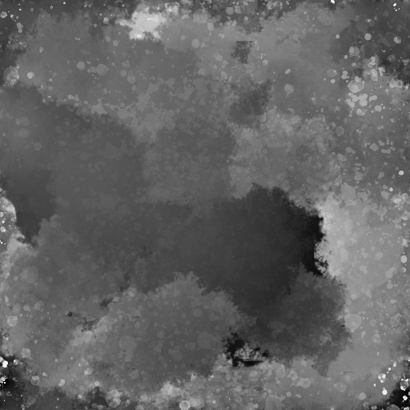</td>
        <td>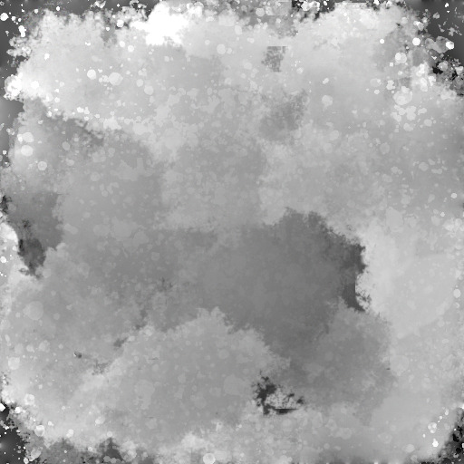</td>
    <tr>
</table>

|Toon Shading + Screen Space Sampled Texture Overlay|
|:-:|
|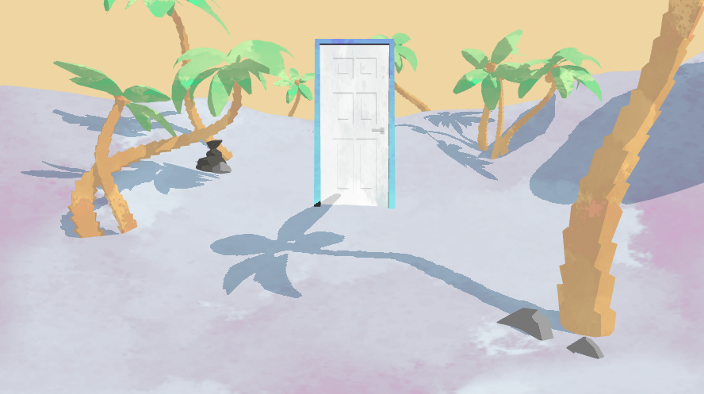|

Something that I tried was to scroll multiple textures at varying speeds in different directions over the surface and then using the multiplied result of that as the overlay texture. The results looked good but it added too much motion to the scene, removing the focus from the doors, so I decided to scrape this idea.

## Outlines

The outlines are a very basic sobel filter, and implemented using Unity's Renderer Features system.

|Outline filter process|
|:-:|
|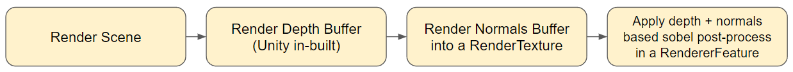|

|Depth buffer|Normal buffer|Outlines|
|:-:|:-:|:-:|
|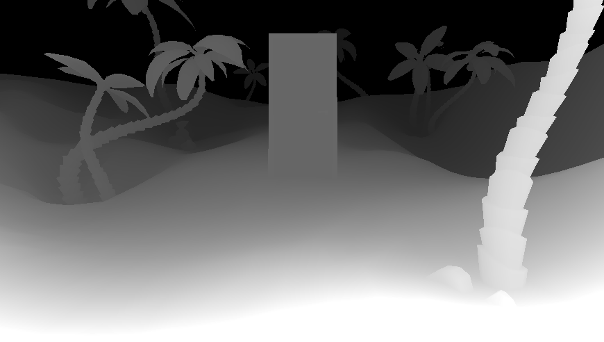|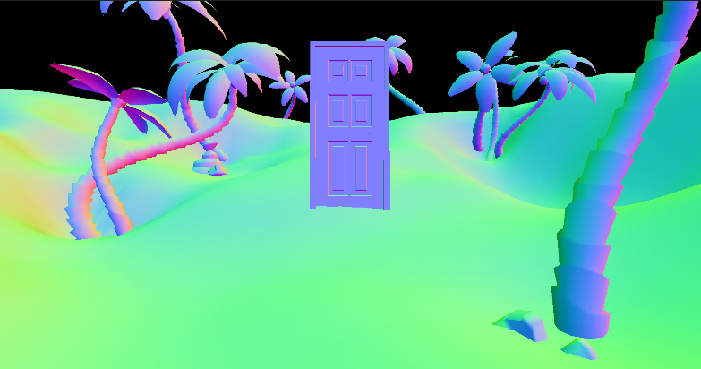|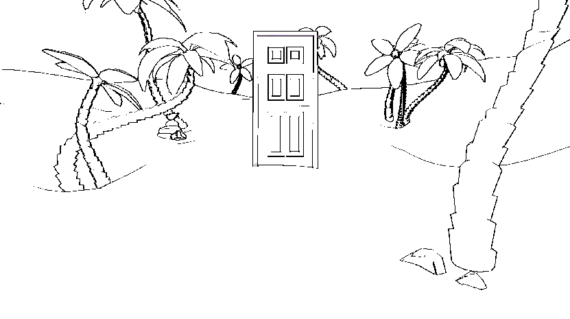|

|Final result with outlines|
|:-:|
|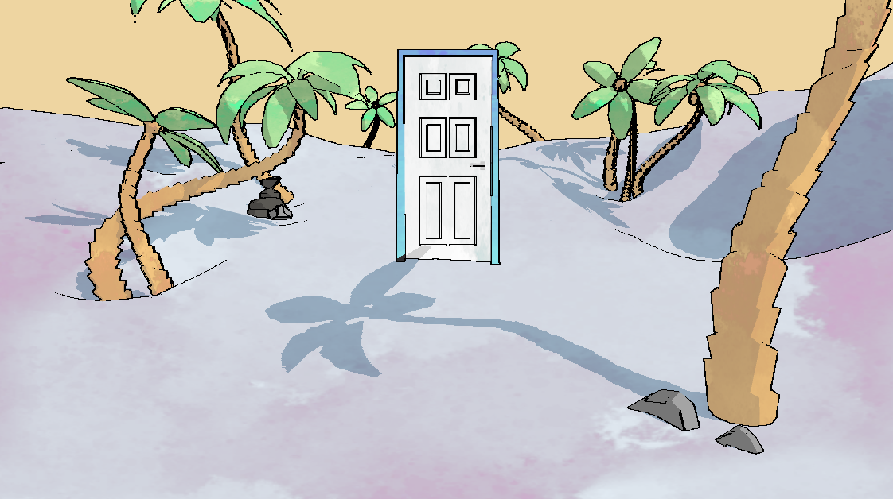|

These outlines are the main part of this project that I really want to spend some time on to improve. I'm not a huge fan of sobel filter based outlines because of their inconsistency, and something like inverted-hull only really works with meshes that can be scaled uniformly (or you need to create a custom outline mesh for everything, not fun). Something worth trying in the future is the Jump Flood method covered by these amazing articles on rendering consistent outlines: [article 1](https://ameye.dev/notes/rendering-outlines/) and [article 2](https://bgolus.medium.com/the-quest-for-very-wide-outlines-ba82ed442cd9).

## Dithered Fading

The scene has two "fake" doors that fade away as the player approaches them, revealing another door behind them. This uses dithered fading based on distance from camera, a technique many games use now because it's sometimes much cheaper than using transparency. Under the hood pixels are simply `discard`ed, and this can be implemented in Unity using alpha clipping. Games do this for performance reasons. This project is not meant to be performance, but I just wanted to achieve fading using something more stylized than a simple fade using alpha.

|Dithering shader graph|
|:-:|
|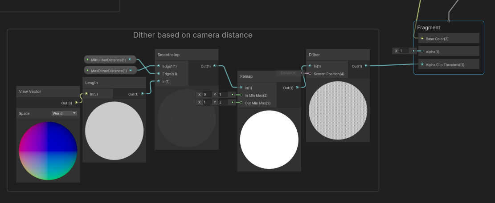|

|Dithered fading|
|:-:|
||

An unfortunate side effect of this method is that anything covered by the material that is faded, but still rendered in the same render queue, will no longer have outlines. This is because the depth and normals buffer are still rendering the object that has been dithered out. For the purposes of this project, this is acceptable.

## Gerstner Waves

I wanted to add a fun element of oceans to the game, to add to the "mystery" of this place the player is in. I first became aware of the concept of Gerstner waves through the "[how water works in Sea of Thieves](https://www.youtube.com/watch?v=EMb_FUmr0Ts)" video by Stylized Station, and I've been obsessed ever since. I've wanted to tackle the challenge of implementing Gerstner waves for a while in whatever projects I worked on, and I finally found the time - and aesthetic reason - to do it!

The simplest form of waves can be created by using a sin wave to displace the vertices of a plane, but this merely makes the vertices move up and down. In a Gerstner wave, each vertex moves in a circular motion. Combining multiple Gerstner waves together results in a complex wave like motion.
[Catlike coding](https://catlikecoding.com/unity/tutorials/flow/waves/) has an excellent explanation and tutorial on implementing Gerstner waves, and my implementation is a modified version of it.

|Gerstner waves|
|:-:|
||

This doesn't really go super well with the overall aesthetic of the scene, but that's okay since the scene is constructed such that the player will only see the waves when they come close to the portal door. The hope is that the door diverts the player's attention, while the out-of-aesthetic-style waves do the work of adding to the mysteriousness of the scene. Perhaps the waves are somehow connected to multidimensional travel... we'll never know.

**Specular highlights on the waves**: Note the sparkling dots on the waves. They appear only in areas that should receive specular highlights based on the game view camera.

## Portal Distortion

As the player approaches the real portal door, the door opens and a distortion effects starts forming inside, which becomes more and more intense as the player gets closer to the door. This is a simple noise based distortion of the scene colour applied to a plane that is aligned with the door. The shader is rendered in the Transparent queue, and the opaque objects would have been rendered before this. This is why the scene colour node returns a valid value from the sampled texture.

|Portal|
|:-:|
||

## Curtains (Vignette?) Post Process Effect

This is probably my favourite effect from this project, simply because how satisfying it turned out to be in the final result! In essence, it's a simple voronoi noise with multiple transformations separately in the horizontal and vertical axes to get a "curtain mask" that is moved based on tweakable parameters. It is applied as a final post-process render feature after all other render passes have finished.

|Curtain Shader|
|:-:|
|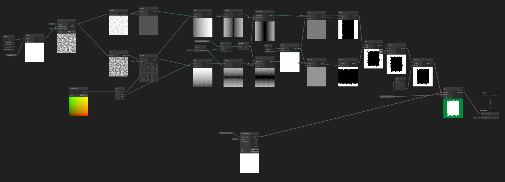|

The specifics are not super important, but you can see towards the right that there are separate horizontal and vertical mask nodes that are combined together. This gives the following result:

|Curtain Effect|
|:-:|
|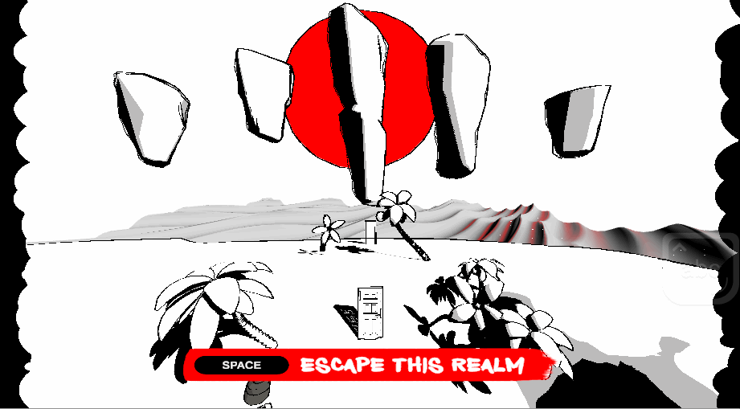|

## The Second Scene

As I mentioned [above](#inspirations), the second realm uses a completely different art style. Except, not really. It's the same toon shaded effects with vastly different parameters. The only addition here is the different skybox and noisy outlines on top of the floating rocks. I'll talk about the skyboxes in the next section. The noisy outlines use the same outline sobel filter, but the sampling of the depth and normal buffers is offset based on a noise. The reason only the floating rocks have noisy outlines is that they have a separate layer, and that layer is processed in a separate outline Renderer Feature.

|Second Scene|
|:-:|
|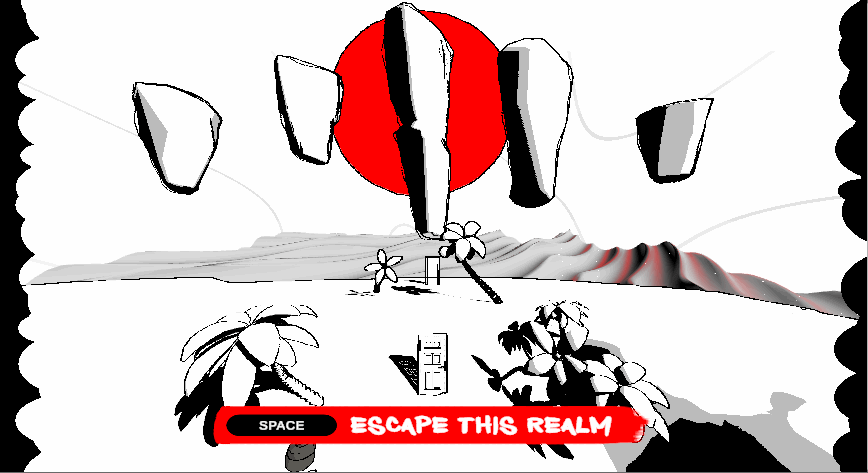|

## Animation Curves!

I use Unity's Animation Curves so aggressively that I felt they deserved their own section. I've got a history of using them in pretty much any animation or gameplay related effect that I've ever implemented, so I wasn't about to stop that for this project. They're just SO useful!

**Player Movement**

If you tried the live demo, you probably noticed that the player speed decreases as the player gets closer and closer to the final portal door. If you didn't notice that, then the transition was subtle enough and did its job, and my efforts worked!

This was implemented by sampling an AnimationCurve to affect the maximum speed a player can achieve, where the `t` value fed into this animation curve was based on the distance of the player from the portal door.

|Max Speed Interpolation Curve|
|:-:|
|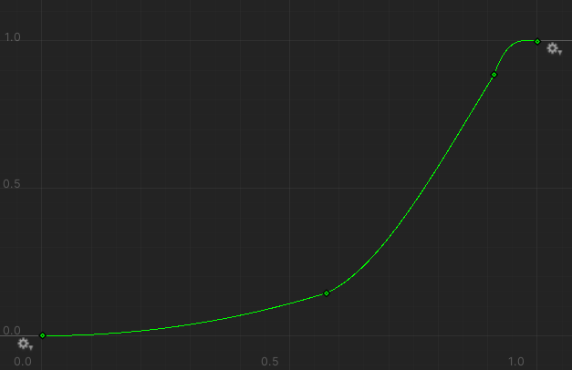|

```C#
float percent = 1.0f - (distance2 / maxDist2);  // get a percent value between 0 and 1. This is linear based on distance.
float t = maxSpeedCurve.Evaluate(percent);      // sample the animation curve based on this percent value. This is not linear.
maxSpeed = Mathf.Lerp(maxSpeedInitial, maxSpeedFinal, t);   // feed this t value into lerp. It's no longer a linear interpolation, but instead based on a curve. "maxSpeedInitial" and "maxSpeedFinal" are user defined values
```

**Curtain Effect Changes**

The same technique is employed to achieve different curtain opening and closing effects by sampling different animation curves, based on different parameters!

In this first example, the curtain closes based on distance of player to door (the curve is reversed from right to left based on distance). First the curtain starts closing in on the screen in "steps", until it approaches the door's boundary, and then it opens up aligned with the door boundary. This was a lot of manual tweaking of the curve by playing the demo, moving closer to the door, seeing where the curtain should be, and applying that on the curve, and this process took a lot of time."

||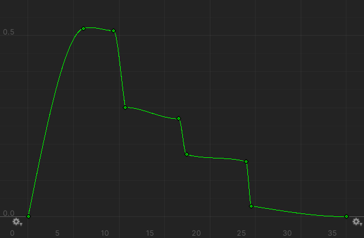|
|:-:|:-:|

In this next example, the curtain opens up based on a timer, but uses this curve to find the t value for interpolation.

|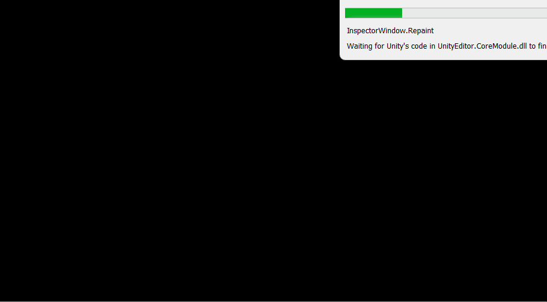|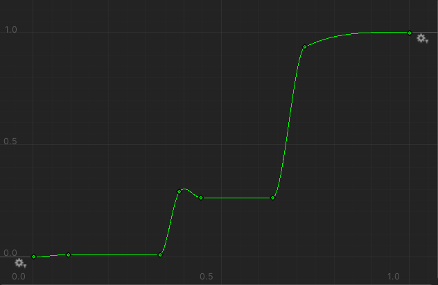|
|:-:|:-:|

**Other use cases**

I've used Animation Curves in pretty much everything, from affecting alpha values to speeds, to changing the camera's FOV when transitioning to the second realm.

|Animation curves|
|:-:|
|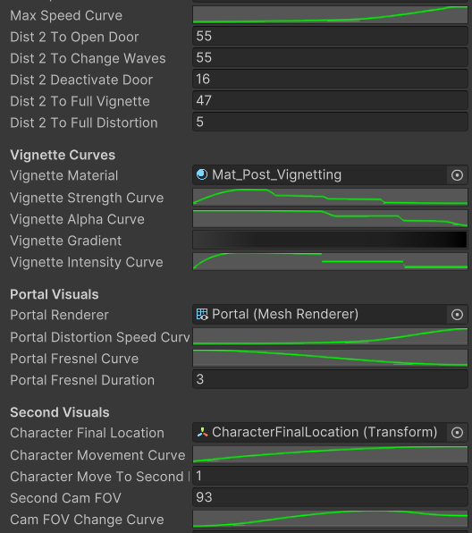|

## Skybox

There are two different skybox shaders in this project, one for each scene.

The first one uses the same watercolour textures used for the toon shader overlay to colour the skybox differently based on the greyscale value of the texture.

|Skybox Shader for first scene|
|:-:|
|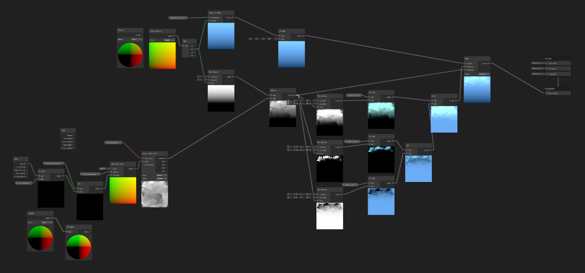|

The second one uses perturbed noise to generate these squiggly lines.

|Skybox Shader for second scene|
|:-:|
|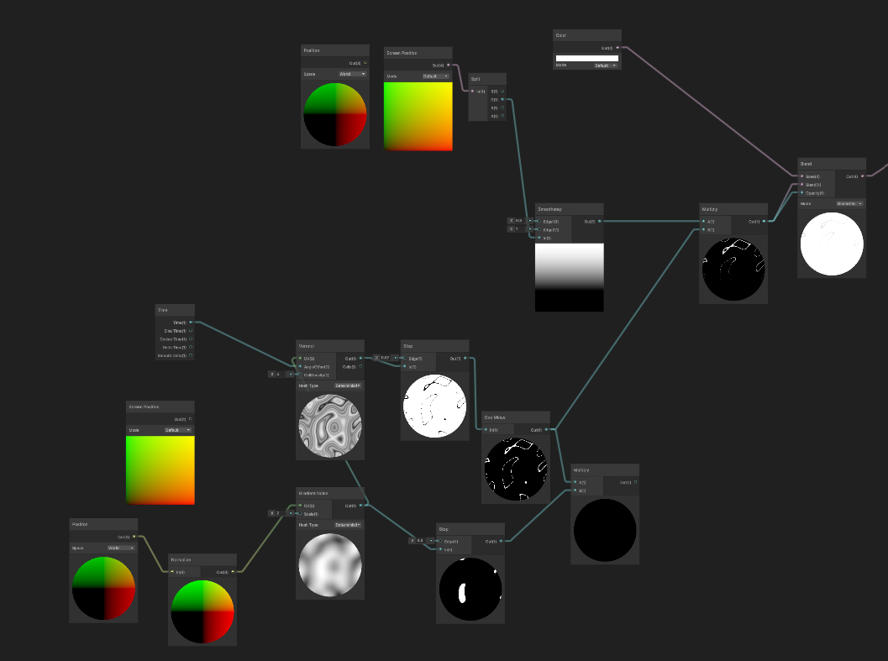|

Both shaders are affected by time and a vertical gradient.

|Skybox 1|Skybox 2|
|:-:|:-:|
|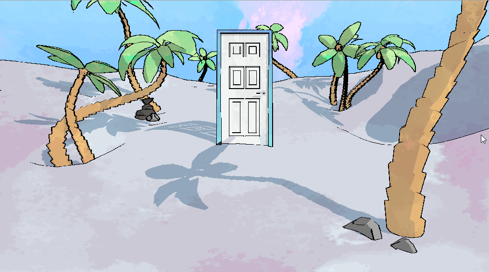||

## UI and Fonts

This is a *playable* demo, and I made a loop where the player walks up to the real portal door in the first realm, is teleported to the second realm, and can return back to the first realm based on key inputs. There was no indication of how to do this. For someone who simply loads the scene, this is just a scene with a static door on a desert, surrounded by a bunch of palm trees. That's not super interesting.

To fix this, I added UI hints in both scenes if you don't do anything for some time. I wanted both realms to be *distinct*, which meant the UI also had to be taken into account when changing the visuals. I made two quick textures in Photoshop for the background of the UI, and found two fonts that suited the overall aesthetics of the scenes. The first one is a cute, friendly, font, but the second one is more grunge. The text hints are very intentional too. Simply saying "move forward" and "reset scene" breaks immersion, whereas "approach door" and "escape this realm" not only tells the player what buttons to press, it also tells them what their objective is. I think this really sells the core theme of realm shift while maintaining immersion.

|UI backgrounds|
|:-:|
|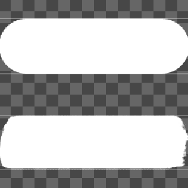|

|UI 1|UI 2|
|:-:|:-:|
||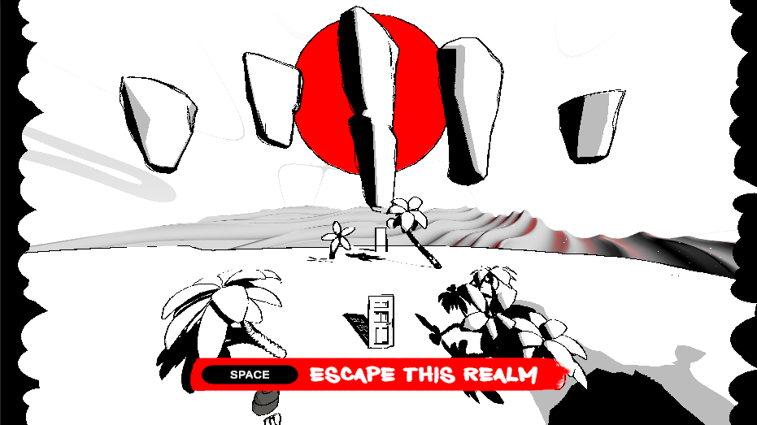|

# Future

- Add music: I *really* wanted to add music and change it along with the visuals, and also affect the visuals in some way based on the music. Perhaps also affect music when the user is nearing the portal.
- Make better outlines: I think these are the weakest portion of this project and can be improved significantly.
- MORE PORTALS: portals are never not fun. Using this system as an excuse to do many different art styles is even more fun.

# Credits

### Style Inspirations
- [This Gris trailer by Nomada Studio](https://www.youtube.com/watch?v=BRiKQIVo7ao)
- [Suzume's door aesthetics](https://www.suzume-movie.com/home/)
- [This artwork by "rudut2015"](https://stock.adobe.com/images/japan-traditional-japanese-painting-sumi-e-art-sun-mountain-sakura-lake/156204903)

### 3D Models
- [Door Model by Arnau Rocher Alcayde](https://sketchfab.com/3d-models/door-d6b9b84b78ae4462a6cf021b412085fe)
- [Palm Tree Models by Parelaxel](https://sketchfab.com/3d-models/stylized-palm-tree-set-b84b734847344cb6a81b9102a64ac63b)
- Other scene assets (rocks, more palm trees, big rocks) by my friend [Ben Spurr](https://www.linkedin.com/in/ben-spurr-3d/)

### Fonts
- ['Anime Ace' by Blambot Fonts](https://www.urbanfonts.com/fonts/Anime_Ace.font)
- ['Eatn Cake' by Chris Vile](https://www.dafont.com/eatn-cake.font)

### Outlines 
- [Tutorial on Depth Buffer Sobel Edge Detection Outlines in Unity URP](https://youtu.be/RMt6DcaMxcE?si=WI7H5zyECoaqBsqF)
- [5 ways to draw an outline](https://ameye.dev/notes/rendering-outlines/)
- [The Quest for Very Wide Outlines](https://bgolus.medium.com/the-quest-for-very-wide-outlines-ba82ed442cd9)

### Gerstner Waves
- [Catlike Coding's Gerstner Waves tutorial](https://catlikecoding.com/unity/tutorials/flow/waves/)
- [Stylized Station's "how water works in Sea of Thieves" video](https://www.youtube.com/watch?v=EMb_FUmr0Ts)
