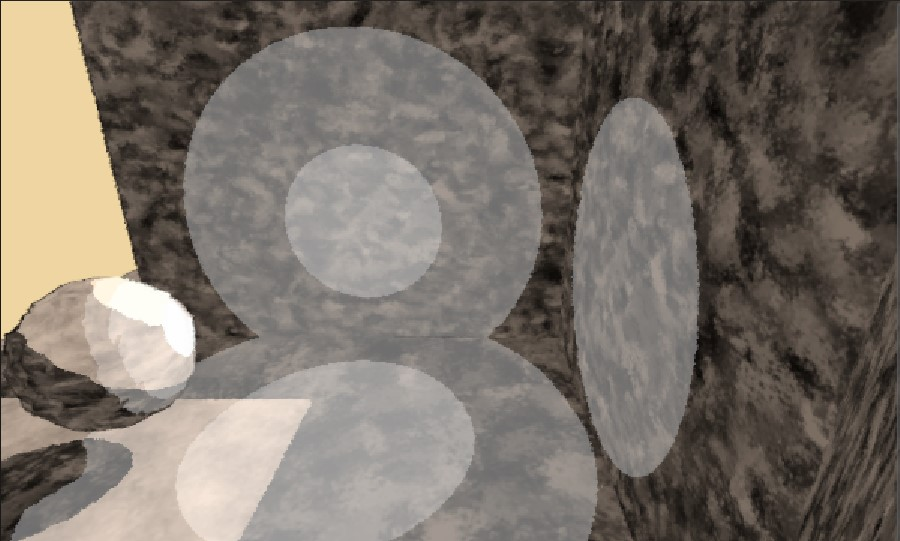
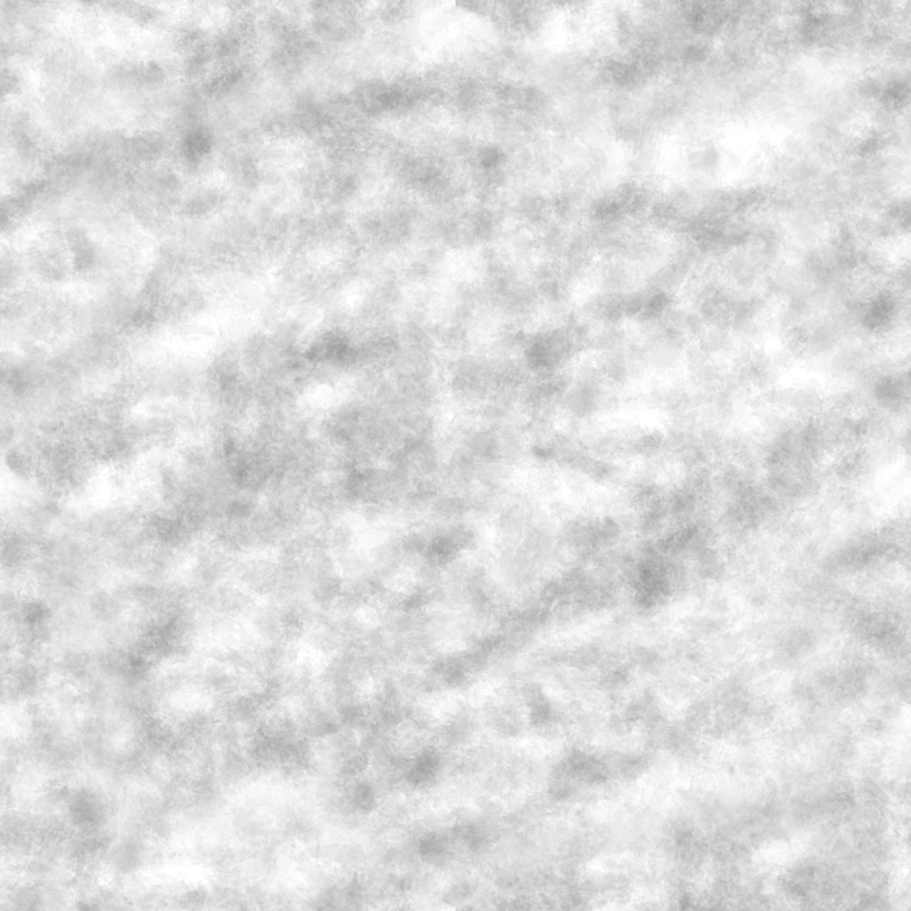
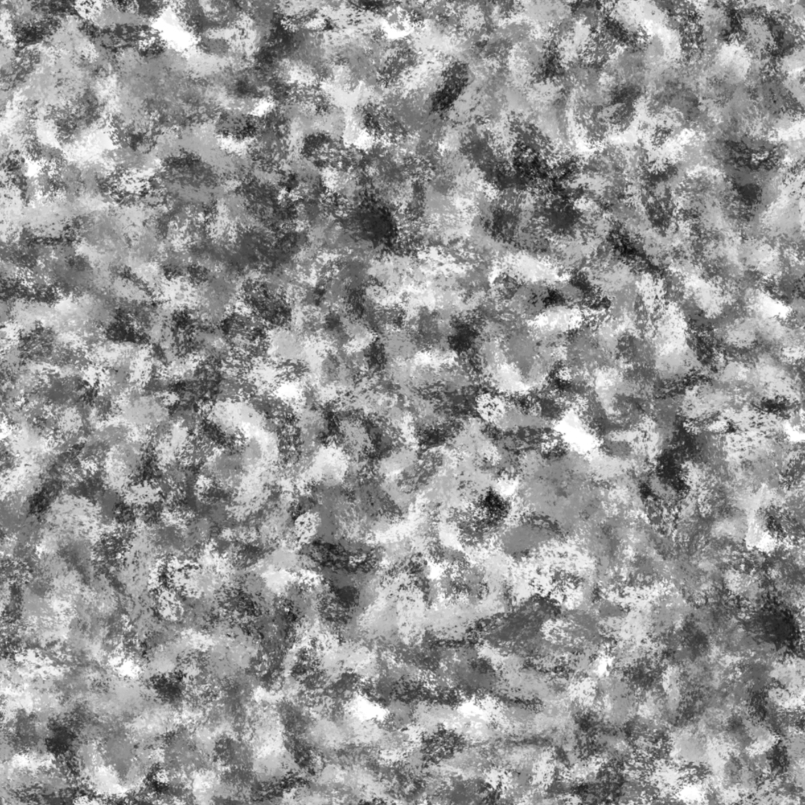
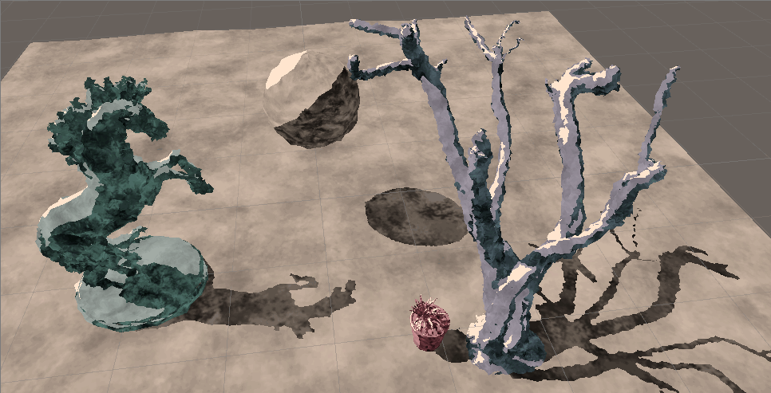
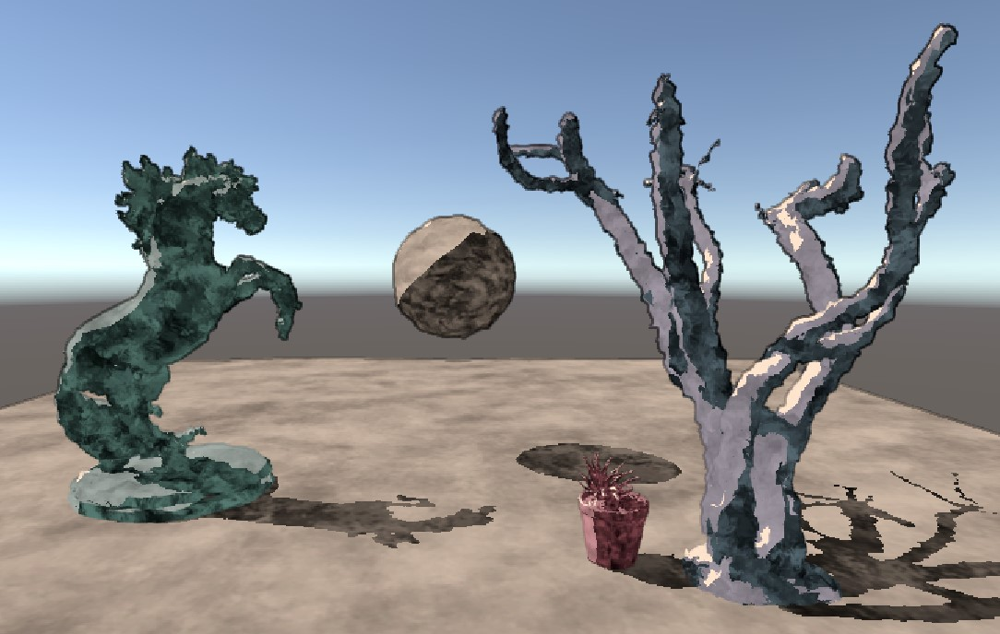
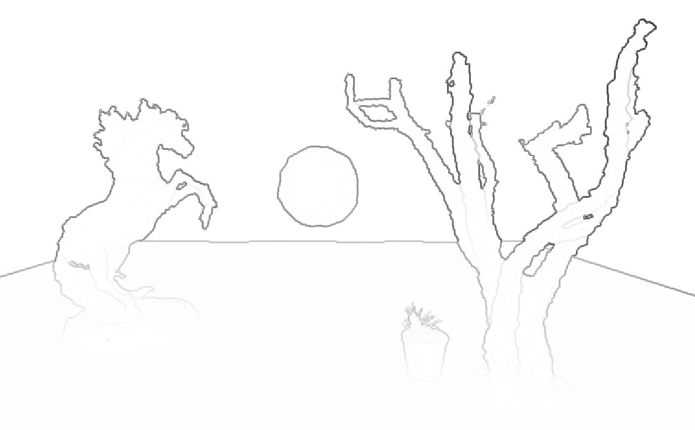
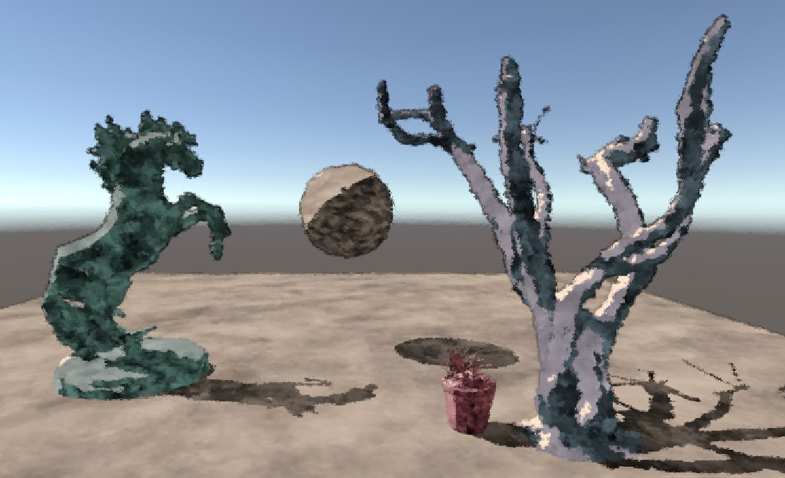
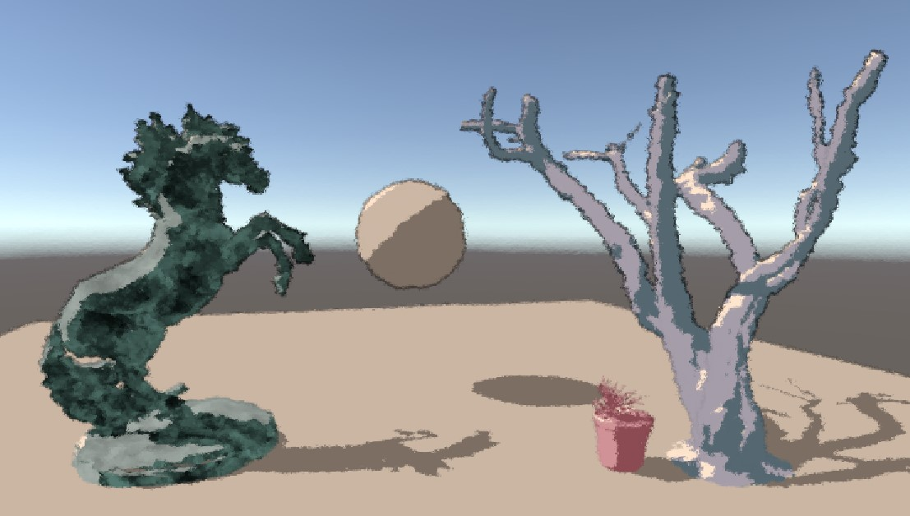

# HW 4: *3D Stylization*

- Chang Liu

### Project Overview

This is a stylization rendering project in Unity.

### Inspiration

*A Mexican Coquette* by Helen Hyde. This piece of art is considerably stylized. Patterns of shadows and highlight can be observed.

### Features

#### Improved Surface Shader and Additional Textures for MidTone and ShadowTone

First, multiple light support is added to the pipeline. Then, the original toon shader was modified to accept to more texture parameters to opt mid tone color and shadow tone color. For shadows, for a more consistent style, after several attempts of shadow textures I eventually removed it.

I created MidTone texture and ShadowTone texture with GIMP using the same brush pattern but different strength and size.

| MidTone Texture                                              | ShadowTone Texture                                           |
| ------------------------------------------------------------ | ------------------------------------------------------------ |
|  |  |

#### Vertex Animation

I added random perturbation to vertices of models based on object space position to keep the render 'flowing'.

#### Outlines

Outline is implemented by using Sobel Matrices to convolute depth difference of sampled neighbors on a depth image. This method gives very interesting varying effect: the less difference the depths, the less significant the outline is.

| Stylized Rendering with Outlines | Outline Only    |
| -------------------------------- | --------------- |
|                    |  |

#### Post Processing

I added a sort of rough glass effect by adding a small offset to sample coordinate based on a normal map.

|  |  |
| --------------- | -------------- |

#### Interactivity

Press `T` to remove or add back MidTone and ShadowTone textures.

