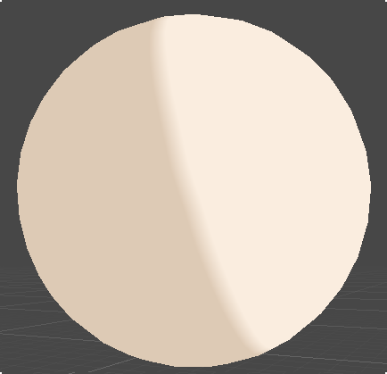
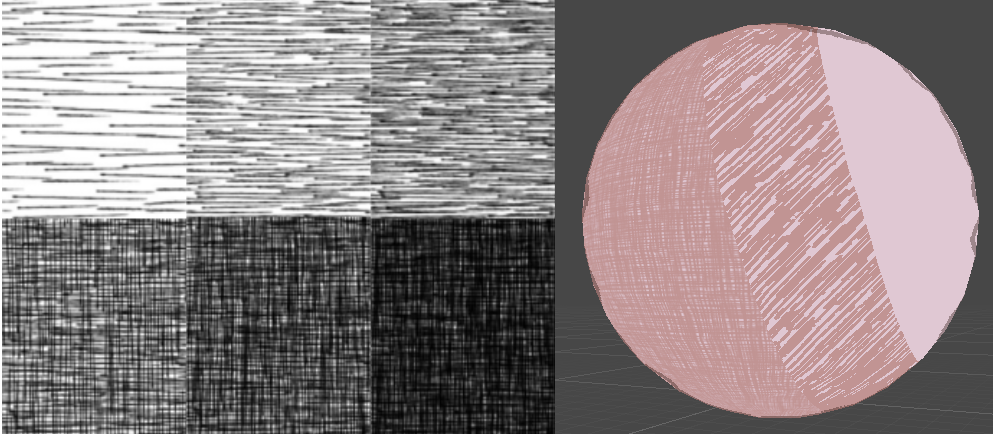
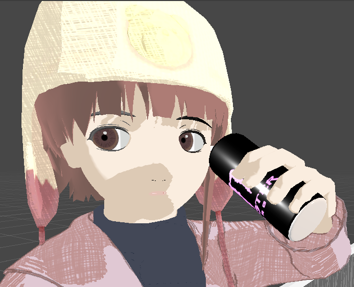
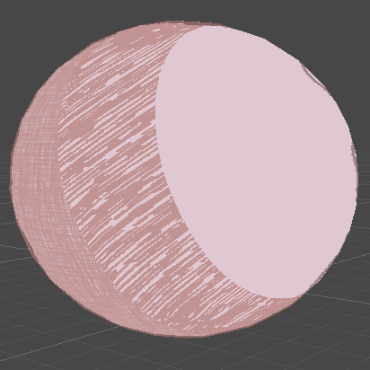
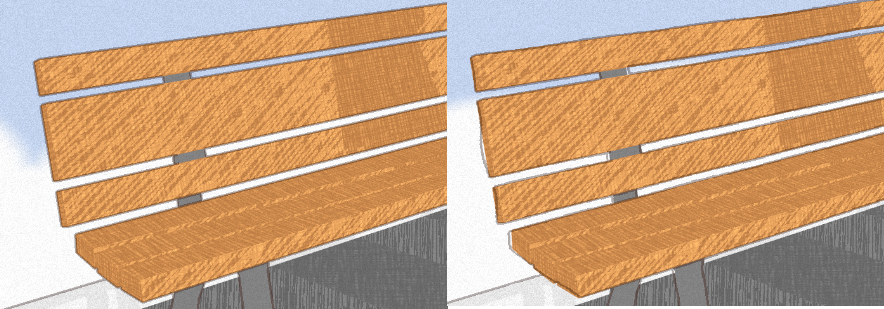

# HW 4: *3D Stylization*

## Result

https://github.com/IwakuraRein/CIS-566-hw04-stylization/assets/28486541/5057922b-4473-4bd0-8405-8b31d6e1cc11

## Reference


Author: [𝖘𝖍𝖆𝖓𝖓𝖎](https://twitter.com/soggyworms)

The skeletal mesh I used is from http://sprishri.nobody.jp/mmd_model1.html.

I used some animation from Mixamo to pose her.

## Interesting Shaders

The surface shaders I used are based on the toon shader in Lab 05. I used different approahces for her skin and cloths.

- I added a transitional zone between highlight and shadow to make the skin looks more natural:



- For her cloths, I used two sketch-look textures for the shadow and transitional zone:



- Based on the Reference Art, there is no need for multiple light sources aren't needed except for the can which has additional highlight. I added a point light source to simulate it.



- I make the shadow on her clothes jittering by randomly altering the UV:



## Outlines

- I use Sobel operator to detect edges on the normal map and depth map:

    ```C
    void normalEdge_float(float2 uv, float2 texelSize, out float edge)
    {
        float3 horizontal = 0, vertical = 0, value = 0;
        sobelEdgeCheck(uv, -1.0 * texelSize.x, -1.0 * texelSize.y, value);
        horizontal += -1.0 * value;
        sobelEdgeCheck(uv, -1.0 * texelSize.x,  0.0 * texelSize.y, value);
        horizontal += -2.0 * value;
        sobelEdgeCheck(uv, -1.0 * texelSize.x,  1.0 * texelSize.y, value);
        horizontal += -1.0 * value;
        sobelEdgeCheck(uv,  1.0 * texelSize.x, -1.0 * texelSize.y, value);
        horizontal +=  1.0 * value;
        sobelEdgeCheck(uv,  1.0 * texelSize.x,  0.0 * texelSize.y, value);
        horizontal +=  2.0 * value;
        sobelEdgeCheck(uv,  1.0 * texelSize.x,  1.0 * texelSize.y, value);
        horizontal +=  1.0 * value;
        sobelEdgeCheck(uv, -1.0 * texelSize.x, -1.0 * texelSize.y, value);
        vertical += -1.0 * value;
        sobelEdgeCheck(uv,  0.0 * texelSize.x, -1.0 * texelSize.y, value);
        vertical += -2.0 * value;
        sobelEdgeCheck(uv,  1.0 * texelSize.x, -1.0 * texelSize.y, value);
        vertical += -1.0 * value;
        sobelEdgeCheck(uv, -1.0 * texelSize.x,  1.0 * texelSize.y, value);
        vertical +=  1.0 * value;
        sobelEdgeCheck(uv,  0.0 * texelSize.x,  1.0 * texelSize.y, value);
        vertical +=  2.0 * value;
        sobelEdgeCheck(uv,  1.0 * texelSize.x,  1.0 * texelSize.y, value);
        vertical +=  1.0 * value;

        edge = sqrt(dot(horizontal.xyz, horizontal.xyz) + dot(vertical.xyz, vertical.xyz));
    }
    ```

- Since I don't want outlines on her face, I implemented the normal outline within the toon shader and added a switch for it. For the depth outline, I implemented in a fullscreen render feature.

- I use Perlin noise to offset the UV when sampling the normal/depth map:

    

## Full Screen Post Process Effect

- I added some film grain by generating random values based on UV and time:

    

- I created some floating clouds in the background by ramdomly generate disks:

    

## Interactivity

Thanks to the deformation bones provided by the model, I can create some animations. I used the [Dynamic Bone plugin](https://assetstore.unity.com/packages/tools/animation/dynamic-bone-16743) to simulate the effect of wind on her hair and the strings of her cap. I created a script that enhances the wind force whenever the user clicks the mouse button:

