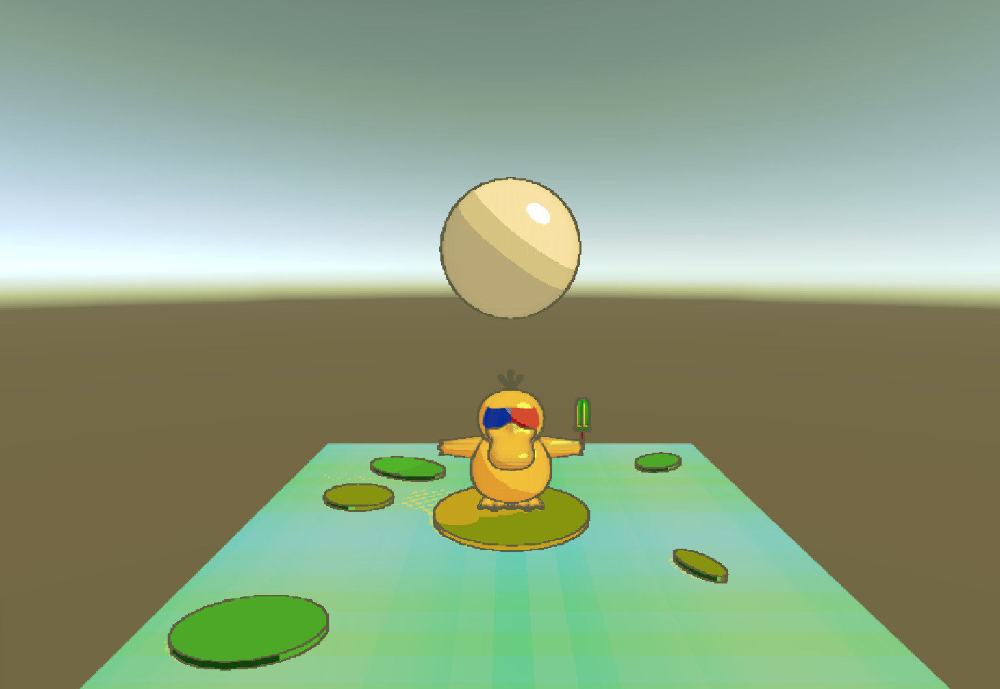

# HW 4: *3D Stylization*

## Project Overview:
Sorry for being late, I had a hard time on working with depth field, but I enjoyed the project overall. Thank you!

### HW Task List:
1. Picking a Piece of Concept Art (yes)
2. Interesting Shaders (yes)
3. Outlines (yes)
4. Full Screen Post Process Effec(yes)
5. Creating a Scene (yes)
6. Interactivity (yes)

---

## 1. Picking a Piece of Concept Art
Art credit:  Danae Correa https://www.artstation.com/artwork/GeklZ3

|  |  |

## 2. Interesting Shaders
1. **Improved Surface Shader**
    I have Multiple Light Support, Additional Light Feature (Specular Light), Customized Shadow(homemade Pokeball shape), and Acuurate Colors

3. **Special Surface Shader**
    I have a color changing animated shaders. 

---
## 3. Outlines
    I did the debug and setup depth and normal buffers. 
    I created a post process outline using depth and normal buffers. 

---
## 4. Full Screen Post Process Effect
    I created a gradient post process filter. 

---
## 5. Create a Scene
    I created the scene with psyduck from sketchlab. 
    Credit: nguyenlouis32 https://sketchfab.com/3d-models/psyduck-fb1fc117788d41c3840f90143095fc5f
## 6. Interactivity
    Enter party mode with space key. 

