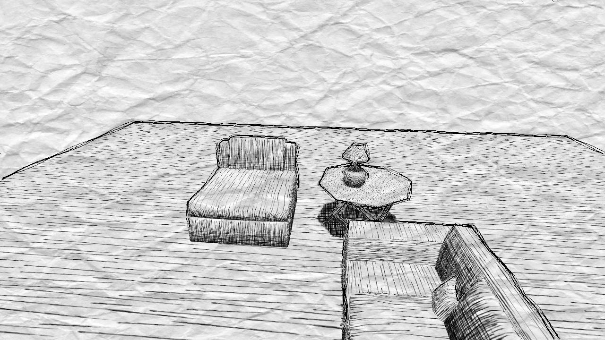
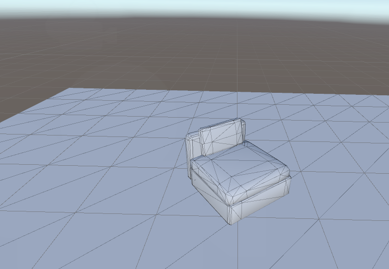
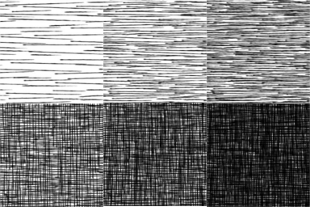
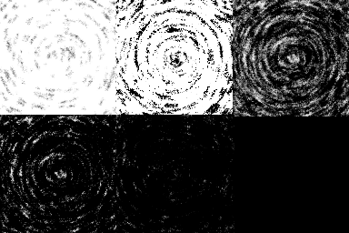
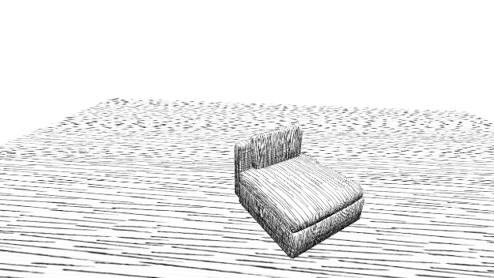
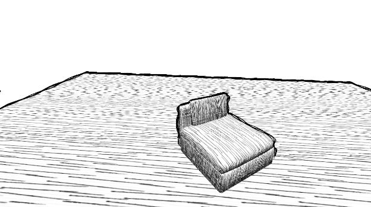
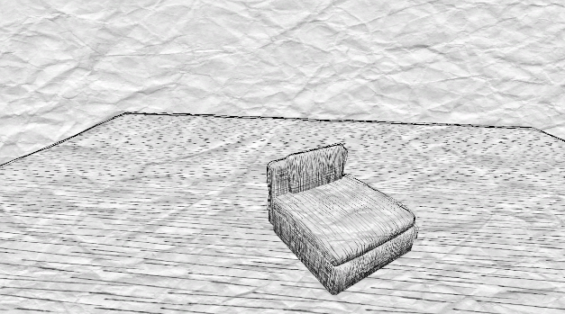

# Unity URP Sketching Stylization Shader
- Name: Tongwei Dai
- email: tongweid@gmail.com

## Demo and Results

https://github.com/dw218192/hw04-stylization/assets/31294154/bf364049-0ecb-4ab2-8273-3aacfc108bfe

- the demo shows features such as material swapping, noisy outlines, and post-processing effects (see below for more details)

## My Inspirations
- I have no specific sample art style to imitate for this project. I just want to make something that has a horror vibe and looks like it's sketched by a pen. Below are the list of artists whose work I took inspiration from when making this project.

| Artwork | Artist |
|-|-|
| | [Ina Koos](https://www.instagram.com/ikoos.art/) |
| | [Junji Ito](https://en.wikipedia.org/wiki/Junji_Ito) |

## Pipeline
- In this section, I will break down the rendering pipeline of my project and explain how I achieved the effects I wanted.
- Suppose we start from this unlit scene:

### 0. Basic Lighting
- I used Blinn-Phong lighting model as the underlying illumination model for my scene. It takes into account all the lights in the scene and calculates the ambient, diffuse, and specular components of the light hitting the surface.

### 1. Hatching Shader
- I started by creating a **hatching shader** , which, given the intensity of the light hitting the surface, will use that intensity to sample the most appropriate **tonal art map**. If we normalize the intensity value to the interval `[0,1]`, then each tonal art map will be sampled at a different interval. For example, if we have 4 tonal art maps, then the first tonal art map will be sampled at `[0, 0.25)`, the second tonal art map will be sampled at `[0.25, 0.5)`, and so on.
- [Kyle Halladay did a great job explaining the concept of tonal art maps in his blog here](http://kylehalladay.com/blog/tutorial/2017/02/21/Pencil-Sketch-Effect.html)
    - 
- I also made another set of tonal art maps in an attempt to imitate the style of Junji Ito's work. The tonal art maps are shown below (note there are only 5 tonal art maps in this set; the hatching shader can take any number of tonal art maps as an input)
    - 

- Using this technique, I was able to achieve the following initial result:

### 2. Outline Shader (Edge Detection Pass)
- Next, I created a simple screen-space outline shader that uses the depth and normal buffers to detect edges. A pixel is flagged as an edge pixel if the difference between the depth of the current pixel and its neighbors is greater than a threshold. The threshold needs to be fine tuned to get the best result for different scenes. 
- I didn't implement sophisticated edge detection algorithms such as Sobel or Robert's Cross because a simple distance-based edge detection algorithm is sufficient for my scene.
- This pass stores the edge detection result in the alpha channel of the render texture (I could probably store it in a single channel texture, but I didn't bother to do that because efficiency is not my concern for this project).

- With the outline shader applied, the above scene becomes:

### 3. Noisy Contour Shader (Post Processing Pass 1)
- After the edge detection pass, I applied a post processing shader that adds noise to and dilates the edges. The shader works by  the UV coordinates of the current pixel by a periodic noise function, achieving a wavy, noisy contour effect.
- Now the scene looks like this:

### 4. Paper Shader (Post Processing Pass 2)
- Finally, I applied a paper shader to the scene to make it look like it's drawn on a piece of paper. The shader works by simply lerping between the original color and a paper color based on how white the current pixel is.
- Note that I dimmed the contour a little bit here to make it more subtle.

## Animations
- I also added some animations to the scene to make it more interesting.
- I make the UV coordinates used to sample the tonal art maps oscillate over time, creating a noisy effect, as if the scene is redrawn by a pen every frame.
- The noisy contour shader also adds some noise to the period of the periodic noise function used to distort the UV coordinates, making the noisy effect more prominent.

## Interactive Demo
- You may find the demo scene in the first video at `Assets/Scenes/Demo.unity`.
- You can press **X** to swap between 2 different pre-configured pen stroke types.

## Configurable Parameters at each stage
### Hatching Shader
- A pen stroke type is defined by an array of tonal art maps that are sampled based on the intensity of the light hitting the surface. The hatching shader takes a `Texture2DArray` as an input, which corresponds to the pen stroke we want to use.

### Outline Shader
- The outline shader uses 2 separate depth and normal threshold values to detect edges. Each threshold value can be configured in the inspector.
- The outline shader also has a variable to control the thickness of the outline.

### Noisy Contour Shader
- The noisy contour shader has variables to control the noise frequency and amplitude.
- Due to the stochastic nature of this stage, I also added offsets and scaling factors to the UV coordinates used to sample the edge texture from the previous stage. This is to make sure that the distorted contour is not too far away from the original contour.

### Paper Shader
- The paper shader takes a `Texture2D` as an input, which corresponds to the paper texture we want to use.

## Credits 
- `Assets/Textures/Stroke1` contains tonal art maps from [Kyle Halladay's blog](http://kylehalladay.com/blog/tutorial/2017/02/21/Pencil-Sketch-Effect.html), which are GPL licensed.
- Furniture models are all found on [Sketchfab](https://sketchfab.com/), which are CC licensed.
- Texture2DArray Importer by [pschraut](https://github.com/pschraut/UnityTexture2DArrayImportPipeline), under MIT license.
