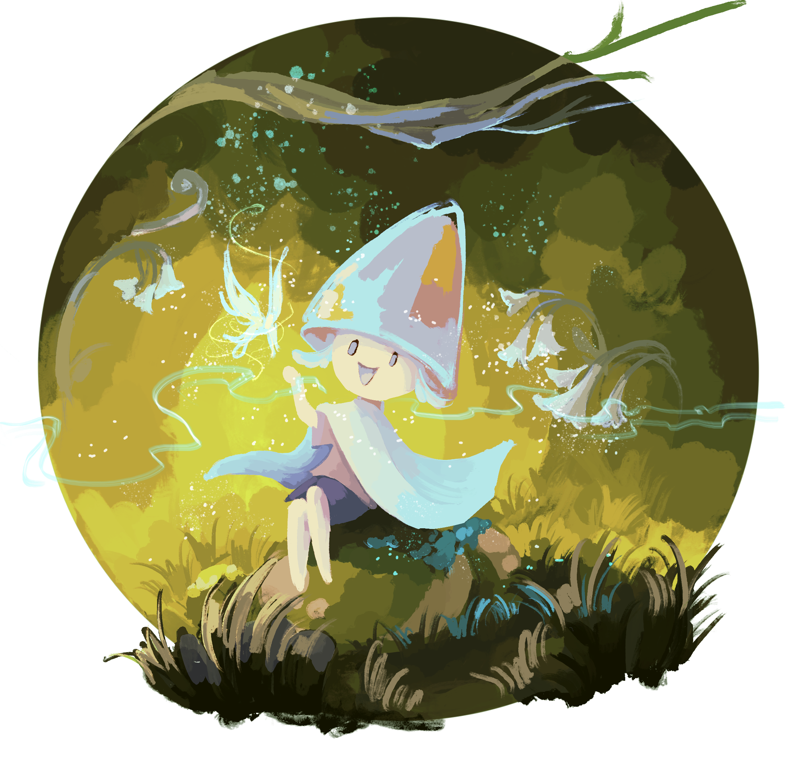
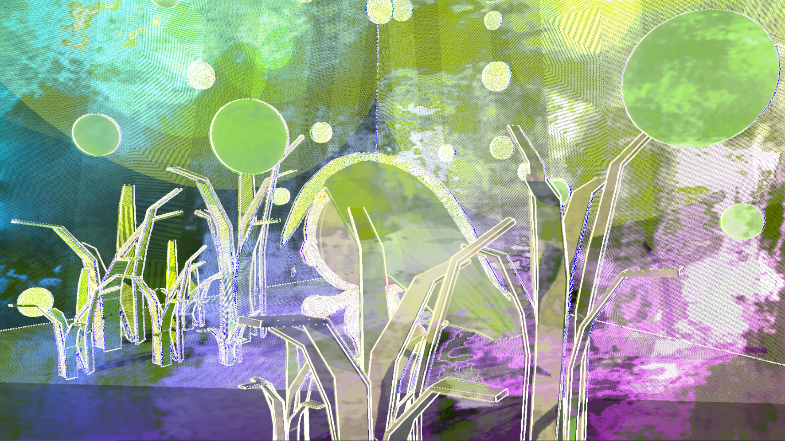
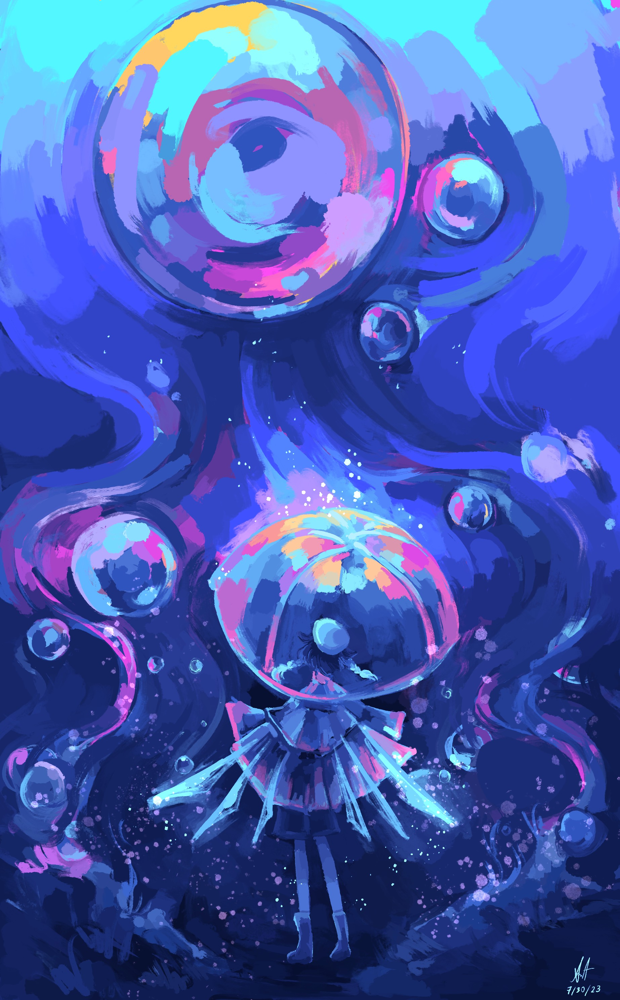
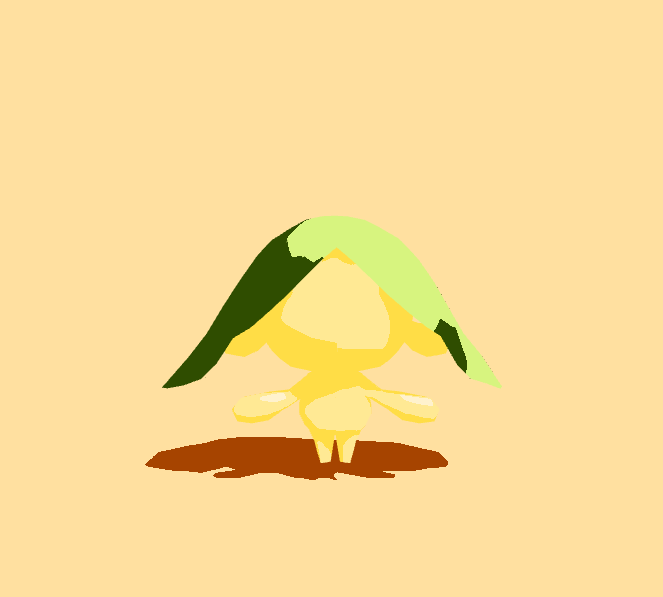
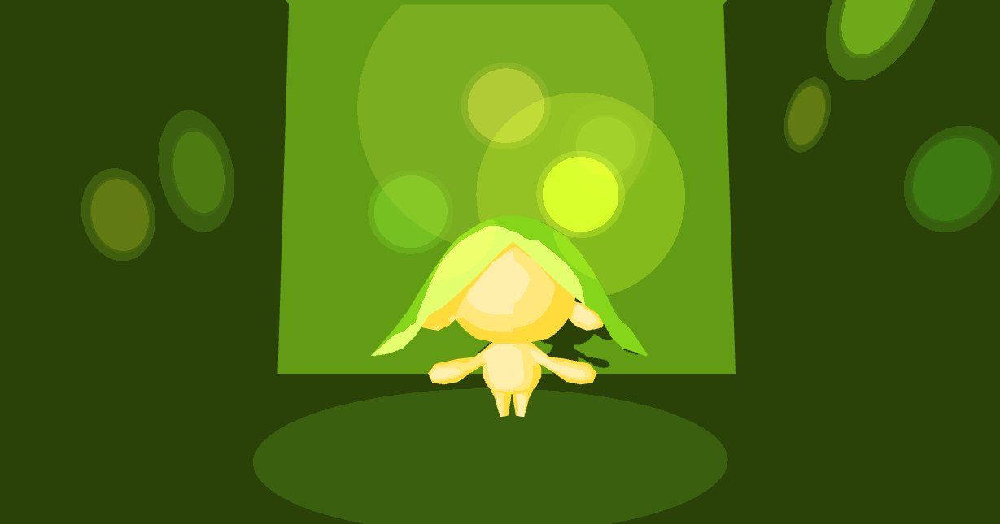
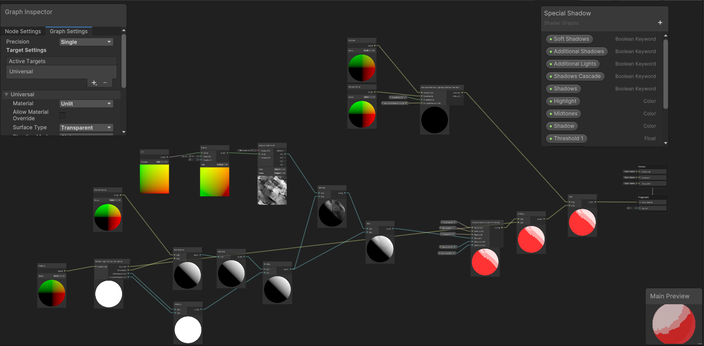

# Stylisation Project: Replicating My Painterly Art Style

## Project Overview:
This project was made for an assignment of creating stylised shaders for my procedural graphics class. I used this opportunity to attempt to replicate my arguably distinct style of artwork with shaders and custom-made 3D models. Every asset that is displayed in this README.md was created by myself.

|   |  |
|:--:|:--:|
| *2D Concept Illustration* | *3D Stylized Scene in Unity* |

Note: I am currently modelling an asset for the mushroom guy from my concept art, which I will then be updating on my README.md once it has been finished.

# Table of Contents:
1. Concept Art
2. Multidirectional Lighting
3. Painterly Shadow Shader
4. Outlines
5. Post Process Effects: The Accidental Shader
6. Post Process Effects: The Watercolour Shader
7. Interactivity

## 1. Concept Art

The concept art that I am using as inspiration for my project is none other than my own artwork. Long has it been my dream to learn how to convert my 2D style into 3D artwork, and finally, I have the prime opportunity to figure out a medium just on doing so. As my art style has been developing for many years in the making, I will be pointing out a few key featuers of my artwork that defines my signature pieces. Below, I will also be attaching examples of such pieces that highlight the pinnacle of my style.

|||||
|:--:|:--:|:--:|:--:|
| Glow | Particles | Painterly Brushstrokes | Blue |

Most of my art is catalogued on my Instagram, @sagescherrytree. Here is the link for my Instagram: *https://www.instagram.com/sagescherrytree/*

---
## 2. Multidirectional Lighting

The first step that I took to implement shaders for my artwork was to add multidirectional lighting. Since I started out this project with a simple three-tone toon shader, my job was to add functionality to sample additional lights that I add on the scene. For that, I added on a custom function that samples additional lights in my toon shader which takes in a world position, normal vector, and a threshold value as an input, and outputs a colour value to be considered for the additional shadows. Adding this colour value to the shader will not do much to change the visual on the shader graph itself, but in the scene, if there is another source of light, there will be another diffuse value calculated for that other light's influence, and that will be considered then in the scope of the additional lighting function. 

To visualise my scene better, I imported an Aranara model that I created, and set up a simple scene with three planes with it. Then, to test the additional lighting, I added some point lights to emulate a simple glow effect to enhance the ambience of my scene in game view. I also created a particle simulation and added lights to them to emulate even more lights, and to add the particles effect that has become a signature in my artworks. 

Here is the Aranara model.
||
|:--:|
||
| A photo I took of my additional lighting affecting my model setup. At this time, I have not added the particle simulation yet. |

https://github.com/sagescherrytree/hw04-stylization/assets/90532115/e0bc13ef-3791-431a-ad86-746df0af2584.mp4

A recording that I took of the additional lighting with the particle simulation emitting lights.

---
## 3. Painterly Shadow Shader

After getting multidirectional lighting to work, my next step was to make my textures more painterly. I actually struggled quite a bit with the logic regarding this step, since I had no idea where to start with making such modifications to my shaders. At the time, several ideas were already being thrown my direction, one which involved painting the normals, which I soon established to be too time consuming. I also scoured the internet for tutorials on how to make cool painterly effects, but all to little avail. I did find a cool reference for a painterly watercolour style shadow, which I will leave the repository reference to here:
[Cool Watercolour Shader Reference](https://github.com/chrisloop/WetShadows)

Below is an image of the shader graph inspired by the reference.


I ended up creating two shaders: one inspired by the fuzzy shadow borders that I saw on Github, and another that applied some extra textures to the threshold of my original toon shader. Below is the shader graph implementation of the toon graph modification shader.


---
## 4. Full Screen Post Process Effect
We're nearing the end! 

### To-Do:
Ok, now regardless of what your concept art looks like, using what you know about toolbox functions and screen space effects, add an appealing post-process effect to give your scene a unique look. Your post processing effect should do at least one of the following.
* A vingette that darkens the edges of your images with a color or pattern
* Color / tone mapping that changes the colorization of your renders. [Here's some basic ideas, but please experiment](https://gmshaders.com/tutorials/basic_colors/) 
* A texture to make your image look like it's drawn on paper or some other surface.
* A blur to make your image look smudged.
* Fog or clouds that drift over your scene
* Whatever else you can think of that complements your scene!

***Note: This should be easily accomplishable using what you should have already learnt about working with Unity's Custom Render Features from the Outline section!***

---
## 5. Create a Scene
Using Unity's controls, create a ***SUPER BASIC*** scene with a few elements to show off your unique rendering stylization. Be sure to apply the materials you've created. Please don't go crazy with the geometry -- then you'll have github problems if your files are too large. [See here](https://docs.github.com/en/repositories/working-with-files/managing-large-files/about-large-files-on-github). 

Note that your modelling will NOT be graded at all for this assignment. It is **NOT** expected that your scene will be a one-to-one faithful replica of your concept art. You are **STRONGLY ENCOURAGED** to find free assets online, even if they don't strongly resemble the geometry/objects present in your concept art. (TLDR; If you choose to model your own geometry for this project, be aware of the time-constraint and risk!)

Some example resources for finding 3D assets to populate your scene With:
1. [SketchFab](https://sketchfab.com/)
2. [Mixamo](https://www.mixamo.com/#/)
3. [TurboSquid](https://www.turbosquid.com/)

## 6. Interactivity
As a finishing touch, let's show off the fact that our scene is rendered in real-time! Please add an element of interactivity to your scene. Change some major visual aspect of your scene on a keypress. The triggered change could be
* Party mode (things speed up, different colorization)
* Memory mode (different post-processing effects to color you scene differently)
* Fanart mode (different surface shaders, as if done by a different artist)
* Whatever else you can think of! Combine these ideas, or come up with something new. Just note, your interactive change should be at least as complex as implementing a new type of post processing effect or surface shader. We'll be disappointed if its just a parameter change. There should be significant visual change.

### To-Do:
* Create at least one new material to be swapped in using a key press
* Create and attach a new C# script that listens for a key press and swaps out the material on that key press. 
Your C# script should look something like this:
```
public Material[] materials;
private MeshRenderer meshRenderer;
int index;

void Start () {
          meshRenderer = GetComponent<MeshRenderer>();
}

void Update () {
          if (Input.GetKeyDown(KeyCode.Space)){
                 index = (index + 1) % materials.Count;
                 SwapToNextMaterial(index);
          }
}

void SwapToNextMaterial (int index) {
          meshRenderer.material = materials[index % materials.Count];
}
```
* Attach the c# script as a component to the object(s) that you want to change on keypress
* Assign all the relevant materials to the Materials list field so you object knows what to swap between.
 
---
## 7. Extra Credit
Explore! What else can you do to polish your scene?
  
- Implement Texture Support for your Toon Surface Shader with Appealing Procedural Coloring.
    - I.e. The procedural coloring needs to be more than just multiplying by 0.6 or 1.5 to decrease/increase the value. Consider more deeply the relationship between things such as value and saturation in artist-crafted color palettes? 
- Add an interesting terrain with grass and/or other interesting features
- Implement a Custom Skybox alongside a day-night cycle lighting script that changes the main directional light's colors and direction over time.
- Add water puddles with screenspace reflections!
- Any other similar level of extra spice to your scene : ) (Evaluated on a case-by-case basis by TAs/Rachel/Adam)

## Submission
1. Video of a turnaround of your scene
2. A comprehensive readme doc that outlines all of the different components you accomplished throughout the homework. 
3. All your source files, submitted as a PR against this repository.

## Resources:

1. Link to all my videos:
    - [Playlist link](https://www.youtube.com/playlist?list=PLEScZZttnDck7Mm_mnlHmLMfR3Q83xIGp)
2. [Lab Video](https://youtu.be/jc5MLgzJong?si=JycYxROACJk8KpM4)
3. Very Helpful Creators/Videos from the internet
    - [Cyanilux](https://www.cyanilux.com/)
        - [Article on Depth in Unity | How depth buffers work!](https://www.cyanilux.com/tutorials/depth/) 
    - [NedMakesGames](https://www.youtube.com/@NedMakesGames)
        - [Toon Shader Lighting Tutorial](https://www.youtube.com/watch?v=GQyCPaThQnA&ab_channel=NedMakesGames)
        - [Tutorial on Depth Buffer Sobel Edge Detection Outlines in Unity URP](https://youtu.be/RMt6DcaMxcE?si=WI7H5zyECoaqBsqF)
    - [MinionsArt](https://www.youtube.com/@MinionsArt)
        - [Toon Shader Tutorial](https://www.youtube.com/watch?v=FIP6I1x6lMA&ab_channel=MinionsArt)
    - [Brackeys](https://www.youtube.com/@Brackeys)
        - [Intro to Unity Shader Graph](https://www.youtube.com/watch?v=Ar9eIn4z6XE&ab_channel=Brackeys)
    - [Robin Seibold](https://www.youtube.com/@RobinSeibold)
        - [Tutorial on Depth and Normal Buffer Robert's Cross Outliens in Unity](https://youtu.be/LMqio9NsqmM?si=zmtWxtdb1ViG2tFs)
    - [Alexander Ameye](https://ameye.dev/about/)
        - [Article on Edge Detection Post Process Outlines in Unity](https://ameye.dev/notes/edge-detection-outlines/)
