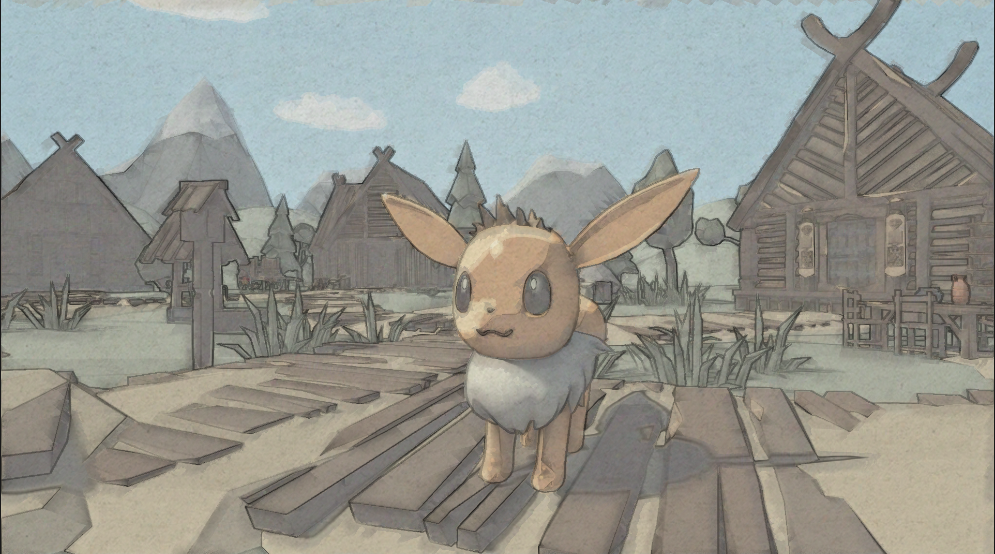
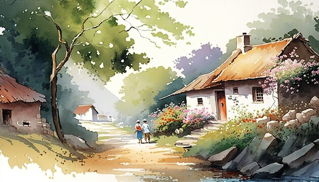
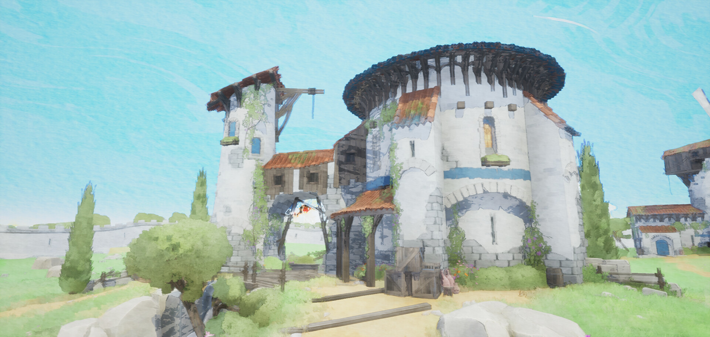
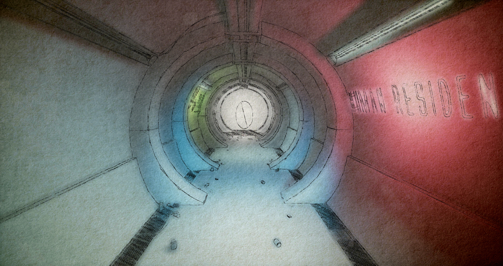
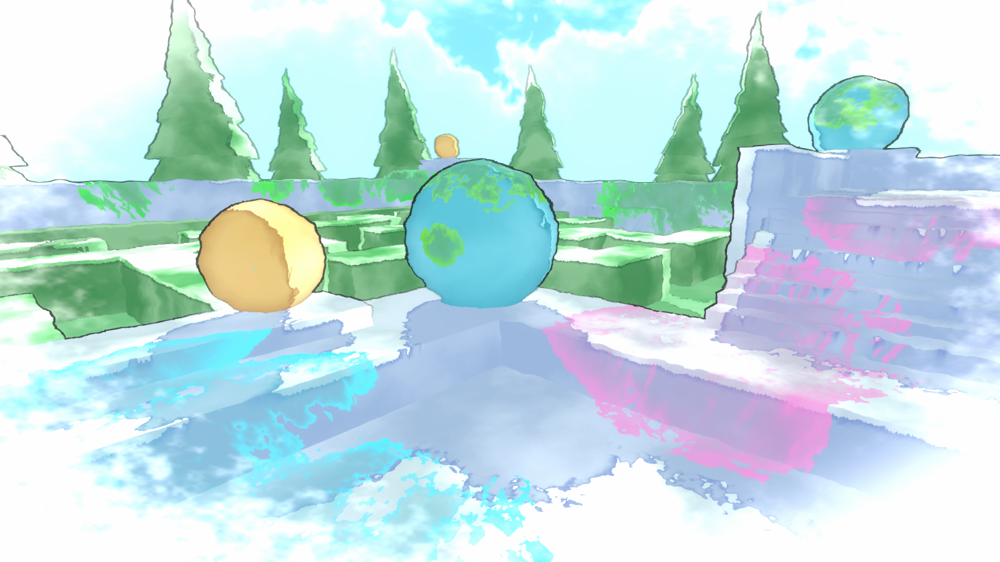
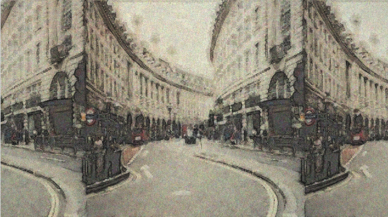
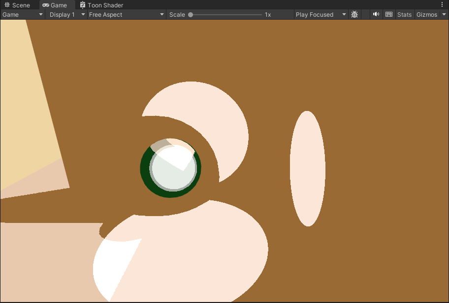
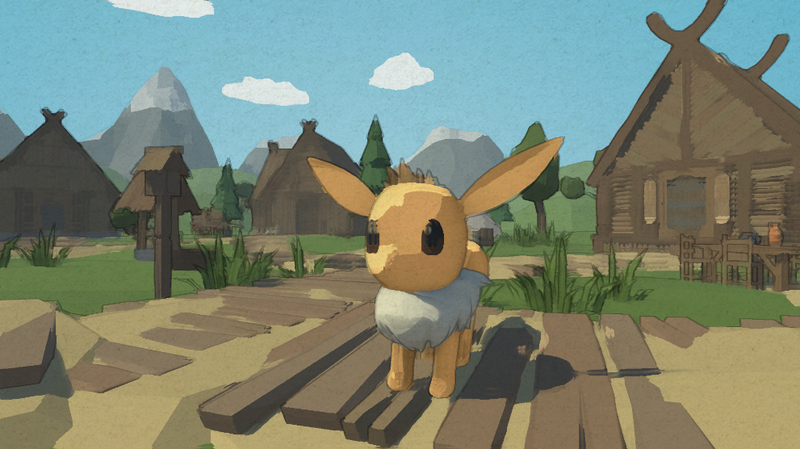

# HW 4: *3D Stylization - Watercolor and oil painting*

## Project View & Demo
This is the project inspired from 2D concept art to produce a 3D stylized interactive scene in Unity. Here, I produced shaders to mimic watercolor art for any 3D object.

You may find a change of style between watercolor art and oil painting art style. It is interactive by clicking space anytime in the scene at "Assets/Scenes/HW final.unity".

## 2D concept art inspiration and reference

I don't refer to a completely same 2D concept art to reproduce the scene. Instead, I refered a series of art style and character art:
||Watercolor art style|Oil paint art style|Eevee model|
|----|----|----|----|
|Ref Images||||
|Link|https://stock.adobe.com/search/images?k=watercolor+landscape+village|https://stock.adobe.com/search/images?k=oil+paint+landscape+village|https://twitter.com/caomor/status/1049494055518908416|

Also, to produce the final style, I refered to a series of similar shader on ArtStation and Shadertoy:
|Reference image|Link|
|----|----|
||https://www.artstation.com/artwork/X1mmqa|
||https://www.artstation.com/artwork/lmO6G|
||https://cyangamedev.wordpress.com/2020/10/06/watercolour-shader-experiments/|
||https://www.shadertoy.com/view/ltyGRV|

## Shader pipeline
  - Additional light support: I added multiple light support and additional lighting features. In the original reference of eevee, highlight of specular light is important to produce a cute outlook. I also added some rim highlight on the side.
  
  - New shadow texture and surface animation: I use a line texture as the shadow with the object's uv to sample it. Also, I use a interpolation to change the color pallete of the whole color tune of the model.

  Here is a surface shader animation of the eevee model on base scene.
  

  - Outlines: I use the gradient in depth buffer to obtain the line on the edge of the model and the scene, and I use different float value to control line thickness and color. To make the outline more vivid, I try to use a stroke mask aside with flipbook node to add noise to the original uv. This will provide an old-school animation play effect with different pages turning.

  - Post effect: This is where I mainly spend time upon. I use a function to gradually blur the strokes based on its gradient in several iterations and keep the color in parallel to the gradient. After blurring the scene to fetch the bleeding coloring effect, I deepen the edges and add the paper texture to it. In the oil painting version of the scene, I use a kuwahara filter to smooth the image while perserving the edge.

  |Watercolor art style|Oil paint art style|
  |----|----|
  |||

