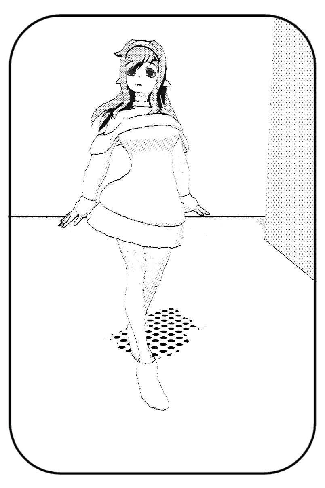

# HW 4: *3D Stylization*

## Project Overview:
This is a Unity project that render 3D scene in stylication. In this project, I render my scene in a special Japanese Manga style, which using black dots to represent black part such as shadow.

    

 

    

 

### Result

    

 

### Third Party Credit
[Reference Image](https://www.too.com/manga/howto.html)

[Elf Girl 3D model](https://sketchfab.com/3d-models/elf-girl-52f2e84961b94760b7805c178890d644)