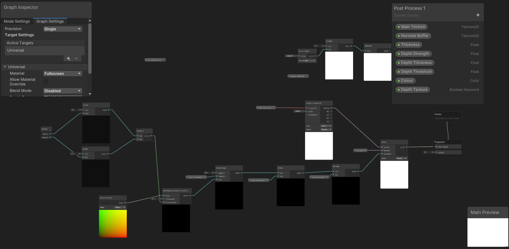

# Stylisation Project: Replicating My Painterly Art Style

## Project Overview:
This project was made for an assignment of creating stylised shaders for my procedural graphics class. I used this opportunity to attempt to replicate my arguably distinct style of artwork with shaders and custom-made 3D models. Every asset that is displayed in this README.md was created by myself.

|   |  |
|:--:|:--:|
| *2D Concept Illustration* | *3D Stylized Scene in Unity* |

Note: I am currently modelling an asset for the mushroom guy from my concept art, which I will then be updating on my README.md once it has been finished.

# Table of Contents:
1. Concept Art
2. Multidirectional Lighting
3. Painterly Shadow Shader
4. Outlines
5. Post Process Effects: The Accidental Shader
6. Post Process Effects: The Watercolour Shader
7. Interactivity

## 1. Concept Art

The concept art that I am using as inspiration for my project is none other than my own artwork. Long has it been my dream to learn how to convert my 2D style into 3D artwork, and finally, I have the prime opportunity to figure out a medium just on doing so. As my art style has been developing for many years in the making, I will be pointing out a few key featuers of my artwork that defines my signature pieces. Below, I will also be attaching examples of such pieces that highlight the pinnacle of my style.

|||||
|:--:|:--:|:--:|:--:|
| Glow | Particles | Painterly Brushstrokes | Blue |

Most of my art is catalogued on my Instagram, @sagescherrytree. Here is the link for my Instagram: *https://www.instagram.com/sagescherrytree/*

---
## 2. Multidirectional Lighting

The first step that I took to implement shaders for my artwork was to add multidirectional lighting. Since I started out this project with a simple three-tone toon shader, my job was to add functionality to sample additional lights that I add on the scene. For that, I added on a custom function that samples additional lights in my toon shader which takes in a world position, normal vector, and a threshold value as an input, and outputs a colour value to be considered for the additional shadows. Adding this colour value to the shader will not do much to change the visual on the shader graph itself, but in the scene, if there is another source of light, there will be another diffuse value calculated for that other light's influence, and that will be considered then in the scope of the additional lighting function. 

To visualise my scene better, I imported an Aranara model that I created, and set up a simple scene with three planes with it. Then, to test the additional lighting, I added some point lights to emulate a simple glow effect to enhance the ambience of my scene in game view. I also created a particle simulation and added lights to them to emulate even more lights, and to add the particles effect that has become a signature in my artworks. 

Here is the Aranara model.
||
|:--:|
||
| A photo I took of my additional lighting affecting my model setup. At this time, I have not added the particle simulation yet. |

https://github.com/sagescherrytree/hw04-stylization/assets/90532115/e0bc13ef-3791-431a-ad86-746df0af2584.mp4

A recording that I took of the additional lighting with the particle simulation emitting lights.

---
## 3. Painterly Shadow Shader

After getting multidirectional lighting to work, my next step was to make my textures more painterly. I actually struggled quite a bit with the logic regarding this step, since I had no idea where to start with making such modifications to my shaders. At the time, several ideas were already being thrown my direction, one which involved painting the normals, which I soon established to be too time consuming. I also scoured the internet for tutorials on how to make cool painterly effects, but all to little avail. I did find a cool reference for a painterly watercolour style shadow, which I will leave the repository reference to here:
[Cool Watercolour Shader Reference](https://github.com/chrisloop/WetShadows)

Below is an image of the shader graph inspired by the reference.

I ended up creating two shaders: one inspired by the fuzzy shadow borders that I saw on Github, and another that applied some extra textures to the threshold of my original toon shader. Below is the shader graph implementation of the toon graph modification shader.

The textures that you can observe on both shaders are custom handpainted textures that I created in Procreate using one of the oil paint brushes. I applied these textures onto the Aranara model and the background box models to generate painted textures in my scene.

|||
|:--:|:--:|
|Painted textures front view.|Painted textures side view.|

I also created a custom sinusoidal function that takes the regular toon shader and warps the border based on mapped values between the threshold values that I set for the toon shaders. Instead of making the values below or above the set thresholds be hardcoded, I instead used another parametre called the Threshold Border, in which I would leave a band where if my Diffuse values were within that band of values, I would apply a function to modify those values and nowhere else. That function is what I affectionately call the Camel function, due to it having two humps to determine where I would be remapping my Diffuse values. Below is the shader graph that I used to generate this custom function that I never used in scene.

As you can see in the shader graph, I first pass my diffuse values through the camel function, which creates the two white bands that you see as the output. Any Diffuse value that matches the values within the white bands will then be rendered with a sine function in my colouring function for the toon shader. Note that the sine function can be interchanged with any type of function. I plan on modifying the sine function to be some variant of noise function in order to mayhaps use entirely procedural techniques to generate my painterly textures, or perhaps to discover a new effect to use in the future.

---
## 4. Outlines
The outlines caused me the most anguish for this assignment because I had a lot of trouble dealing with the render features for the URP pipeline. I first tested that my normals rendering feature was working on the URP rendering pipeline, and when I did, I proceeded to follow [this tutorial](https://www.youtube.com/watch?v=RMt6DcaMxcE) by NedMakesGames to create the outlines in the Outlines.hlsl file. However, I soon discovered that my outlines were not showing up at all despite my depth map having been activated. It appears after some debugging that my depth map only generated values from between 0.01 - 0.04, which was causing the parametres for the outline to be drawn was extremely small. I found a method around this roadblock by using the normals to implement the outline instead of using the depth map, which gave me significantly better results due to the fact that my normals were always being mapped from a scale of 0 - 1. Here is the code that I used to generate the sobel normal maps for the outlines.

However, getting the shader to generate the outline shapes themselves was only the first step to getting shapes around my outlines, because if I applied this shader as it is directly to the rendering feature, then my result would turn into a black and white outline of every object in my scene, where my goal was to retain the original colour integrity of the scene despite the post process. Therefore, I added a lerp node before I output my shaders that took in the main texture value of the scene and the outline colour and used the value obtained from the sobel shader to interpolate between these two values. That way, only on very bright patches of the sobel shader will colour be drawn. Below is an image of the shader that I used to generate outlines.

Here are some of the results that I got by using my outline shader.
|||
|:--:|:--:|
|Post process white coloured outlines, normal.|Post process glitch displacement outlines with some applied perlin noise.|

## 5. Post Process Effects: The Accidental Shader
This shader came about as I was attempting to use my scuffed depth values to create outlines around my objects. I ended up preserving the shader after I saw its warped effects on my scene, which I personally thought matched the callousness of my brushstrokes, and my occasional use of brush layer post processing on my own artwork. Here is the shader in action.

|||
|:--:|:--:|
|Funny post process shader side shot.|Funny post process shader front shot.|

---
## 6. Post Process Effects: The Watercolour Shader
The watercolour post process effect came about as I was tooling away at more render features after I had finished implementation of the base scene. As I had the glow, particles, and painterly textures, my next step was to perhaps... add another interesting overlay over my scene? After all, one of the processes that I always perform at the tail end of creating one of my pieces is to add layers upon layers of post processing over my 2D artwork, including countless overlays, adds, and colour burns for my more intensive pieces. I decided to play with the texture that I gave myself as a painterly texture base, and I ended up getting a shader that essentially covered splotches of my scene in blue/purple tints, giving it a slight watercolour effect. I ended up liking this shader quite a bit, so I kept it. Here is a video of me using said shader. 

https://github.com/sagescherrytree/hw04-stylization/assets/90532115/9188d4be-c6ec-43bc-ae6b-a84c844e76ef.mp4

Here is also a shader graph with the experimental watercolour implementation.

|||
|:--:|:--:|
|Watercolour post process shader front view.|Watercolour post process shader back view.|

## Interactivity
For the interactivity component, I simply made the buttons of the post processing able to be turned on and off, so that you are able to see the layers getting added one right after another.

Since the video of the breakdown file is too big, I will leave a copy of it in the Pictures folder. Please find it and watch it as you please.

## Resources and inspirations:

1. CIS 5660 laboratory videos:
    - [Playlist link](https://www.youtube.com/playlist?list=PLEScZZttnDck7Mm_mnlHmLMfR3Q83xIGp)
    -  [Lab Video](https://youtu.be/jc5MLgzJong?si=JycYxROACJk8KpM4)
2. Interwebs references:
    - [Chris Loop](https://github.com/chrisloop/WetShadows)
    - [NedMakesGames](https://www.youtube.com/@NedMakesGames)
        - [Toon Shader Lighting Tutorial](https://www.youtube.com/watch?v=GQyCPaThQnA&ab_channel=NedMakesGames)
    - [Cody Gindi](https://www.youtube.com/watch?v=s8N00rjil_4)
        - I did not actually use his code, but I considered it because the effects were too pretty!
