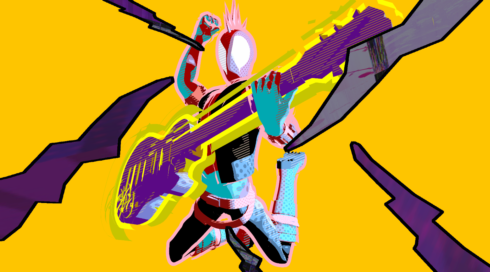
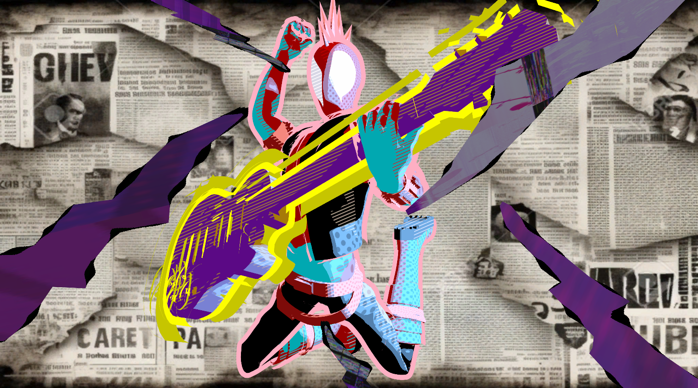
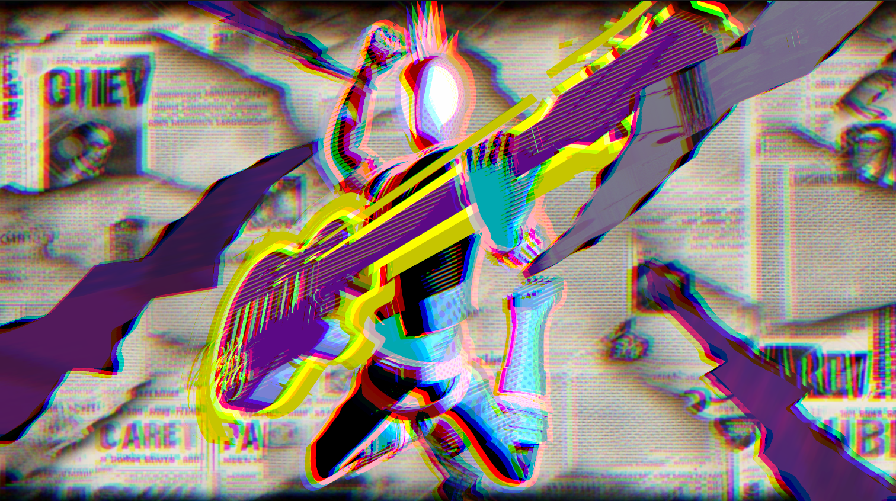

# Punk Rockin' Shader Graphs:guitar:

This is my first attempt at both generating **stylized renders** as well as working with **Unity's shader graphs**. As soon as the context of *stylized* was established for this project, the first thing to come to my mind was the Spiderverse movie franchise. Gwen's Universe and Hobie Brown's Spider Punk were the 2 most stylistically mind-blowinig aspects of the movie for me personally, and therefore it was imperative that I pick one of those as my reference goals. And I am really happy with how the final outcome turned out - see below (**Sound ON**:sound:)! (Here is a [link](https://vimeo.com/882373896?share=copy) to a high-res video).

https://github.com/Saksham03/stylization-unity-shader-graph/assets/20259371/80740788-7d6f-4ee6-b9bc-a8412a86890b

[comment]: <> (without music: https://github.com/Saksham03/stylization-unity-shader-graph/assets/20259371/2852c33d-b1d7-4eda-91fa-92bc8a4ba933)

|   |  |
|:--:|:--:|
| *2D Concept Illustration* | *3D Stylized Scene in Unity* |
## Table of Contents

* [Toon Shading](#toon-shading)
* [Light Interaction](#light-int)
* [Ben-Day Dotting](#ben-dot)
* [Inverted Hull](#inv-hull)
* [Assembling the Scene](#scene)
* [Post-Process Outlines](#outlines)
* [Renderer Features](#ren-feat)
* [Vignette](#vignette)
* [User Interactivity](#user-int)

## First things first: Toon Shading

The very first step towards getting a stylistic looking scene complementing the concept art chosen for the project was to get a toon shaded material. The shader graph implemented for the same can be found in `Assets/Shaders/Toon Shader.shadergraph`. The desired result was achieved by:  
1. Factoring in the contribution from the **Directional Light**.
2. Exposing threshold values for **highlights** VS **shadow areas**.
3. Using a **hatching texture** to define a **midtone** between highlights & shadows.

  

Hatching texture used for shadows:  

## Light Interaction
After factoring in the Directional Light for the Toon Shader, we need to consider more light sources in the scene such as point lights. The`ComputeAdditionalLighting` function in `Assets/Shaders/Includes/LightingHelp.hlsl` helps us achieve this. We use the same by adding a **Custom Function** node in `Assets/Shaders/Toon Shader.shadergraph`. To demonstrate the result, we use a **Blue-colored point light**:  
1. When the point light is far away, only the Directional Light affects the material:

2. As we move the point light nearer, the interaction of light results in a highlight appearing on the material's surface:

## Specular Highlights - Ben-Day Dotting!
Ben-day dotting is a fairly common art style found in comics, wherein a polka-dot texture overlay is used to depict certain stylistic elements. This style has also recently found its way in many games and movies. Examples:  
  

I add this support by adding another distance-based factor to the Toon Material, such that moving the point light even more closer to the surface results in a more highlighted area where I sample the polka-dot texture to generate a ben-day dotted effect:  

Polka-dot texture used for specular highlights:  

## Contextual Spice-Up: Inverted Hull
Looking back at the chosen concept art, we see a non-uniform outline surrounding Hobie Brown (Spider-Punk) and his guitar. This was one of the most impressive stylistic choices in the film, wherein Hobie always had this wiggly outline containing him. To get a similar look, I decided to implement an **Inverted Hull**. This was implemented as a separate shadergraph that can be found in `Assets/Shaders/Inverted Hull.shadergraph`. The implementation is basically as follows:
1. A scaled-up version of the mesh is first established by extruding the vertices of the original mesh along the surface normal.
2. Next, we choose the option in Shadergraph to render only the back faces, so that front faces always get culled, and we are able to view the material in front no matter which camera angle we are looking from:

The extrusion along normals causes the mesh to 'break-apart' for larger scaling factors. I tried adding a vertex displacement noise to achieve the non-uniform boundary look from the concept art, but couldn't figure out a good way to achieve that look due to time restrictions. Therefore, I used low and appropriate scale values to get a slightly different but appealing final look. _(It is not a bug, it is a feature. Right?)_

## Assembling the Scene
I was able to find [this](https://sketchfab.com/3d-models/spider-punk-from-across-the-spider-verse-31b9e56833d34121a9a0012985c6bc09) fantastic FBX model on Sketchfab by [CVRxEarth](https://sketchfab.com/CVRxEarth). I was also able to find [this](https://sketchfab.com/3d-models/lightning-4bb6b257007e4797b2edd68dedb22664) lightning model asset by [daedaljs](https://skfb.ly/6D8Io) licensed under [Creative Commons Attribution](http://creativecommons.org/licenses/by/4.0/). I got to work on creating the materials:  
  
At this point, I had the following scene assembled:  

Finally, I added a blue point light to include the Ben-Day dotting effect:  

## Up Next: Post-Process Squiggly Outlines
To match the concept art, I attempted to render outlines on the lighting assets as a **Sobel Post-Process** using Depth and Normal Buffers. The script for this can be found at `Assets/Shaders/Includes/EdgeDetectionOutlines.hlsl`. This was implemented in its own shadergraph `Assets/Shaders/Edge Detection Outlines.shadergraph`. A static outline implementation looks something like:
  
The material created off of the shadergraph has a check-box for applying Noise that the user can toggle ON or OFF. If noise is applied, then the output looks something like:  

## Moving On - Renderer Features
Unity's **URP (Universal Render Pipeline)** gives us access to **Renderer Features**, wherein we can define custom render tasks at certain steps in the rendering pipeline. I used render features for 4 things:  
1. Rendering the Normals in to the **Normals Buffer**,
2. **Background**  
In `Assets/Shaders/Background.shadergraph`, I define a simple Full screen shadergraph that samples a given texture to render it on the entire screen. I use a newspaper background texture downloaded from the internet to match the concept art. This gives us the following result:
  

3. **Drawing the Normals** on the screen before we move on to apply post-processing effects, and
4. **Chromatic Aberration**  
To give the iconic glitchy effect to my render, I chalked out a quick and easy shadergraph `Assets/Shaders/ChromAberr.shadergraph` that applies Chromatic Aberration to the entire screen:  
  

Our Renderer Features look something like this:

  

## One Final Post-Process: Vignette
The URP also allows us to use some out-of-the-box post-processing overlays, and I chose to use the Vignette filter because it went well with my final output:

  

## User Interactivity
To author some level of user interactivity, I wrote the script `Assets/Scripts/MatSwapKeypress.cs` that swaps a material's texture to the next one in the list on hitting the **Space Bar**. I used this on the lighting assets, adn the final result looked something like this:

 

## Still Here? Thank You!
If you made it all the way here, I apologize for rambling on and on about every minute detail of the project. I had a lot of fun learning Unity, shader graphs, and non-photorealistic rendering techniques, and hope to pick up more such projects in the near future! Thank you for reading through my brain dump, hope you have a great day!
