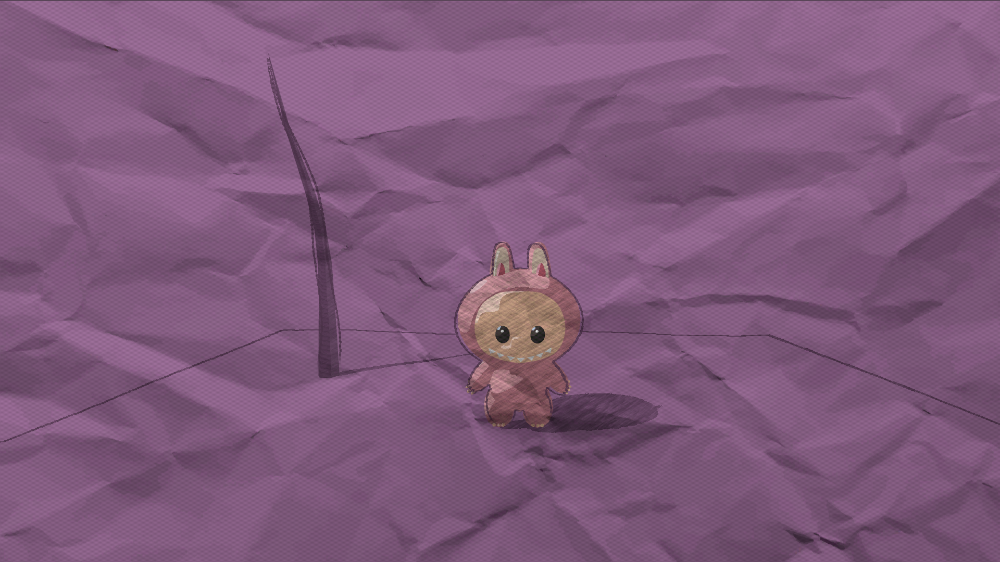

# Unity URP Sketching Toon Shader

* Ruijun(Daniel) Zhong
## Demo:

||||
|:-:|:-:|:-:|
|Reference Image|Created Maya FBX|Toon Shading|

## Inspiration
  
Author: Peter Rush   
[Link](https://urbansketchers.org/2017/02/07/sketching-with-colour-pencils/)  
This project inspired from 2D sketch art. I have emulated a hand-drawn, sketch-like aesthetic within my 3D stylized interactive scene to capture the essence of paper-feel artistry.

## Implementation
### 1. Creating basic toon shader color & multiple lights support
  
* Creating sketching textures:

### 2. Vertex animation

### 3. Post Process & Outlines
* Blended a paper texture with outline generated by the Sobel method, utilizing both the normal and depth buffers for enhanced detail. Adjusted randomness offset and color of the outline to make it more sketching feeling.

### 4. Real-time render with interactivity
* Press space to change materials

## Credits:
* [Sketching Textures](https://www.youtube.com/watch?v=FpvJAG6R99k)
* [Applying Texture on toon shader](https://www.youtube.com/watch?v=U51yrbgBmAo)
* [Outlines](https://www.youtube.com/watch?v=LMqio9NsqmM)
* [Paper Textures](https://www.creativefabrica.com/product/crumpled-paper-texture-background-3/)
