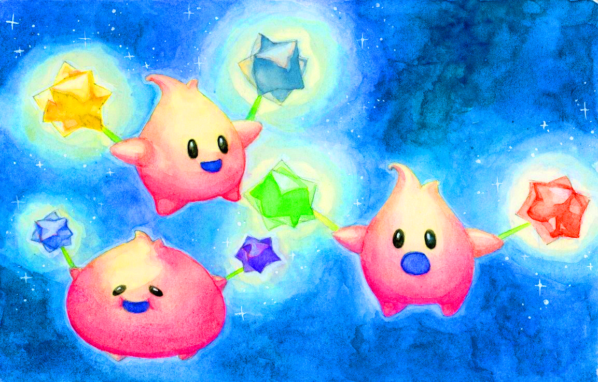

# HW 4: *3D Stylization*

Note: I asked Rachel for an extension on this project as I've been overwhelmed with school and work deadlines :(

## Project Overview:
In this project, I set out to create a 3D stylized scene in Unity, drawing inspiration from 2D art references.

|   |  |
|:--:|:--:|
| *2D Concept Illustration* | *3D Stylized Scene in Unity* |
### Table of Contents:
1. Inspiration & Concept Art
2. Interesting Shaders
3. Outlines
4. Full Screen Post Process Effect
5. Creating a Scene
6. Interactivity

---

## 1. Inspiration & Concept Art

### Super Mario Galaxy
- For this project, I drew inspiration from one of my favorite games - Super Mario Galaxy! Everything from the cute characters to the vibrant colors have always brought me so much joy and comfort. In particular, I've always loved the Luma characters and knew I wanted to center my project around them.
### Traditional Art
- Additionally, I've always loved sketching and watercolor painting as art forms, so I wanted to incorporate elements of these as well. A few of my reference images are watercolor paintings, so I hope to add some sort of watercolor paper texture to my shader. Although my references generally do not have outlines, for the sake of learning, I will try to create animated outlines with a sketchy, hand-drawn effect using noise.

## Concept Art
- Below are some art references I used to create my custom shader:

---
## 3. Outlines

Next, I created a post process outline effect based on the Depth and Normal buffers of my scene using the sobel edge detection method, complete with a few adjustable parameters such as line thickness. The outlines are animated using perlin noise, and the color of the outlines is animated using my custom rainbow color function which shifts the hue of the outline color over time.

---
## 4. Full Screen Post Process Effect
I added a watercolor paper overlay to my scene, as well as a white watercolor-style vignette effect.

---
## 5. Create a Scene
To create my final scene, I used 3D models from Super Mario Galaxy. The models were obtained from The Models Resource:
https://www.models-resource.com/wii/supermariogalaxy/

I modified most of the materials in the scene to use either my custom Luma shader (with the special scrolling galaxy effect), or my "stage" shader, which has a custom shadow but no scrolling galaxy overlay. I brightened the colors of each material to create a very vibrant final result.

## 6. Interactivity
As a finishing touch, I added a material swapping script to my scene and fine-tuned the turntable effect to both rotate and translate the camera very slowly. When the user presses the space bar, the material on each Luma will be switched so that they change colors! I wish I had more time to actually animate the little guys, but for now this is what I was able to achieve.
 
---

## Final Result!

Videos of my results:

https://drive.google.com/file/d/1JjvHjLzPiGKP8uw8jMes_L9kBCJN4yQL/view?usp=drive_link
https://drive.google.com/file/d/1G6deDIw-n78ekuMrCV60hgykCSvvWXub/view?usp=drive_link
https://drive.google.com/file/d/1HZ7rHFPPz9X8U56KX6d8_ECsSCUACyHY/view?usp=drive_link

## Resources:

All of Logan's wonderful tutorial's the videos linked in the original assignment! :)

https://www.models-resource.com/wii/supermariogalaxy/

https://www.youtube.com/watch?v=RMt6DcaMxcE&ab_channel=NedMakesGames

https://www.youtube.com/watch?v=GAh225QNpm0&ab_channel=KetraGames

https://www.youtube.com/watch?v=TPiyOplgtV8&ab_channel=GamingThemes

https://www.youtube.com/watch?v=t52yhi0C98o&t=1s&ab_channel=WilmerLinGASchool

https://www.youtube.com/watch?v=p9IRxv6tPoY&t=33s&ab_channel=WilmerLinGASchool

https://www.youtube.com/watch?v=2L8gS9mtwLk&ab_channel=WilmerLinGASchool
